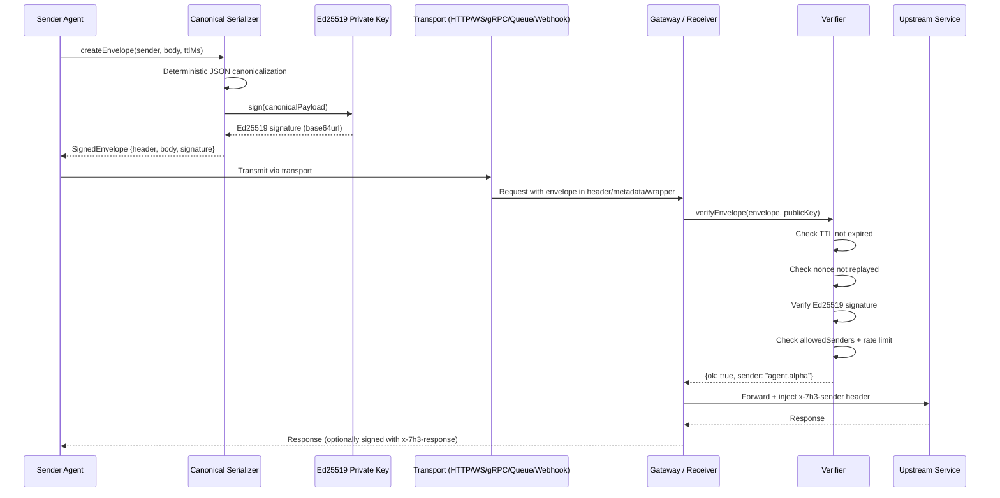
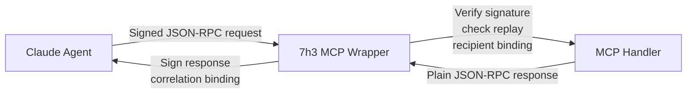
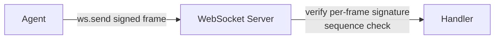
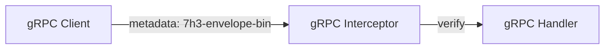
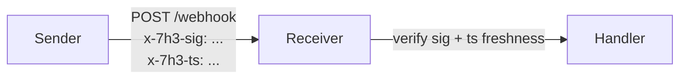
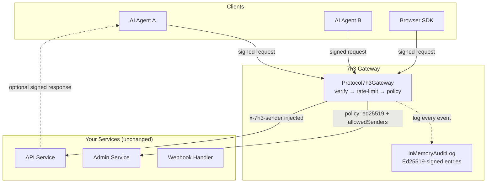
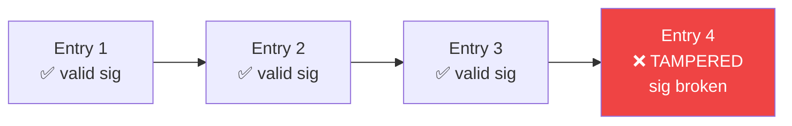

<div align="center">
  

  <br/><br/>

  [](https://www.npmjs.com/package/@7h3/protocol)
  [](https://www.npmjs.com/package/@7h3/protocol-browser)
  [](https://pypi.org/project/7h3-protocol/)
  [](https://crates.io/crates/protocol-7h3)
  [](https://github.com/IceMasterT/7h3-protocol/tree/main/src)
  [](./package.json)
  [](./docs/VERSIONING_POLICY.md)
  [](./LICENSE)

  <br/>

  **Cryptographic signing and replay protection for AI agent messages. One envelope. Every transport.**

  <br/>
</div>

---

## The Problem

AI agent systems are moving fast, and the protocols underpinning them were not built with message-level security in mind.

**MCP (Model Context Protocol)** is plain JSON-RPC 2.0. A message in flight has no signature. Any intermediary — a rogue proxy, a compromised queue consumer, a misconfigured load balancer — can alter tool call parameters or replay a previously captured request. The MCP handler on the other end has no way to know.

**A2A (Agent-to-Agent)** improves on this by signing Agent Cards, giving agents a verifiable identity at the domain level. But Agent Cards are static configuration, not per-message traffic. Once an agent is "trusted," every message it sends thereafter is implicitly trusted regardless of whether the specific message was tampered with in transit or is a replay from ten minutes ago.

**HTTP APIs** default to IP-based rate limiting. IP addresses are trivially spoofed or shared — a single compromised NAT or cloud egress IP can represent thousands of agents. And there is no standard replay prevention: the same valid signed request can often be submitted multiple times, triggering duplicate writes, payments, or tool executions. There is no tamper-evident audit trail baked into the infrastructure — logs can be deleted or altered after the fact.

The gap these protocols share is identical: they authenticate *agents* at the connection or identity level, but they do not authenticate *individual messages* at the content level. 7h3 Protocol fills that gap without replacing any existing protocol.

---

## What 7h3 Protocol Does

7h3 Protocol wraps every message — regardless of transport — in a **signed envelope**. The envelope is compact, deterministic, and verifiable by any peer that holds the sender's public key (or shared secret).

The protocol provides four security primitives, all in one structure:

| Primitive | Mechanism |
|---|---|
| **Authentication** | Ed25519 or HMAC-SHA256 signature ties the message to a specific key |
| **Integrity** | Signature covers a canonical byte-identical serialization of the full envelope |
| **Replay prevention** | TTL expiry + unique nonce; a replayed envelope will fail `(messageId, nonce)` deduplication |
| **Non-repudiation** | Ed25519 asymmetric keys mean only the holder of the private key could have produced the signature |

The same envelope format works over HTTP, WebSocket, gRPC, message queues, and webhooks. One library. One wire format. Every transport.

---

## How It Works

### Ed25519 Signing

Each sender generates an Ed25519 keypair. The private key signs messages; peers verify using the public key. Because Ed25519 is asymmetric, a peer that can verify your signatures cannot forge them — compromising one agent does not compromise the signing key of another.

For cases where key distribution is impractical, HMAC-SHA256 over a pre-shared secret is also supported, though it provides authentication without non-repudiation.

### Canonical Serialization

Signatures only mean something if everyone signs the same bytes. JSON object key order is not guaranteed by the spec, so the same message can serialize differently on different platforms. 7h3 Protocol solves this with deterministic JSON canonicalization: keys are sorted alphabetically at every nesting level, optional absent fields are omitted entirely (not set to `null` or `""`), and the result is UTF-8 encoded with no trailing whitespace.

The canonical form is identical byte-for-byte across TypeScript, Python, Rust, and Go. The conformance test suite proves this with shared test vectors.

### TTL and Nonce

Every envelope carries:
- `timestampMs` — when the message was created (Unix milliseconds)
- `ttlMs` — how long the message is valid
- `nonce` — a random value unique to this message

A receiver rejects the envelope if `now > timestampMs + ttlMs`. It then checks `(sender, messageId, nonce)` against a deduplication cache. A replayed envelope is rejected even if the signature is valid.

### The Envelope Structure

```
{"body":{"capability"?:"...","content":"...","correlationId"?:"...","intent":"..."},"header":{"messageId":"...","nonce":"...","recipient"?:"...","sender":"...","timestampMs":N,"ttlMs":N,"version":"7h3/0.1"}}
```

Optional fields (`capability`, `correlationId`, `recipient`) are omitted when absent — not set to `null` or `""`. This is load-bearing for the canonical form: any variation breaks the signature.

### Sequence Diagram



---

## 🔒 Security Guarantees

| Attack | Defense |
|---|---|
| **Impersonation** | Ed25519 signature — only the private key holder can produce a valid signature; no private key means no forgeable message |
| **Replay attacks** | `(messageId, nonce)` deduplication cache + TTL expiry — a captured valid message cannot be resubmitted |
| **Tampering** | Signature covers the canonical serialization of the full envelope body; any modification breaks verification |
| **Unauthorized access** | Per-route `allowedSenders` policy — envelopes from unlisted senders are rejected before reaching upstream |
| **Response spoofing** | Signed responses with `x-7h3-response` header; `correlationId` binding ties the response to the specific request |
| **Rate abuse** | `SlidingWindowRateLimiter` keyed by verified sender identity, not IP — VPN and NAT sharing does not grant extra quota |
| **Audit trail manipulation** | `InMemoryAuditLog` entries are themselves Ed25519-signed and chained; tampering with any entry breaks the chain |

---

## 🤖 Works with Claude (MCP)

Claude's tool-calling mechanism is MCP (Model Context Protocol), which uses plain JSON-RPC 2.0. 7h3 Protocol hardens MCP traffic without requiring any changes to your MCP handler.

`wrapMcpServer` wraps an existing MCP handler and enforces:

- **Signature verification** — every inbound JSON-RPC request must carry a valid 7h3 envelope
- **Replay protection** — `InMemoryReplayCache` injected automatically
- **Recipient binding** — the server rejects envelopes not addressed to its own `selfAgentId`, defeating cross-server relay attacks
- **Sender binding** — the client accepts responses only from the declared `peerAgentId`, defeating response spoofing
- **Correlation binding** — `correlationId` in every response must match the request's `messageId`, defeating response substitution



**Server side:**

```ts
import { wrapMcpServer, signEnvelopeEd25519 } from '@7h3/protocol'

const secureServer = wrapMcpServer(myMcpHandler, {
  selfAgentId: 'my-mcp-server',
  sign: (e) => signEnvelopeEd25519(e, serverPrivateKey, 'k1'),
})
```

**Client side:**

```ts
import { wrapMcpClient, signEnvelopeEd25519 } from '@7h3/protocol'

const { send } = wrapMcpClient({
  selfAgentId: 'my-client',
  peerAgentId: 'my-mcp-server',
  sign: (e) => signEnvelopeEd25519(e, clientPrivateKey, 'k1'),
  receive: {
    signatureResolver: async ({ keyId }) => ({
      alg: 'ED25519',
      publicKey: serverPublicKey,
    }),
  },
})

const response = await send({ jsonrpc: '2.0', id: 1, method: 'tools/list' }, fetch)
```

The MCP handler itself is unchanged. The wrapper handles all envelope logic at the boundary.

---

## ⚡ Transport Coverage

7h3 Protocol covers all five common agent transports with the same signing primitives.

### HTTP / REST

Signed envelopes travel in the `x-7h3-envelope` request header. The gateway verifies before forwarding; upstream receives `x-7h3-sender` and `x-7h3-verified: true`.

```mermaid
flowchart LR
    A[Client] -->|POST /api/action\nx-7h3-envelope: {...signed...}| B[API Gateway]
    B -->|verify signature\nrate limit check| C{Policy match?}
    C -->|✅ pass| D[Upstream Service\nx-7h3-sender: agent.alice\nx-7h3-verified: true]
    C -->|❌ fail| E[401 / 403 / 429]
```

```ts
import { createEnvelope, signEnvelopeEd25519 } from '@7h3/protocol'

const envelope = await signEnvelopeEd25519(
  createEnvelope({ sender: 'agent.alice', intent: 'write', content: JSON.stringify(payload) }),
  privateKey, 'k1',
)

await fetch('https://api.example.com/action', {
  method: 'POST',
  headers: { 'x-7h3-envelope': JSON.stringify(envelope) },
  body: JSON.stringify(payload),
})
```

### WebSocket

Each frame carries a signed JSON envelope with a monotonically increasing `sequenceNumber` to detect out-of-order or dropped frames.



```ts
import { wrapWebSocket } from '@7h3/protocol'

const ws = new WebSocket('wss://agent.example.com/stream')

const secure = wrapWebSocket(ws, {
  sender: 'agent.alpha',
  sign: (e) => signEnvelopeEd25519(e, privateKey, 'k1'),
  verify: (e) => verifyEnvelopeEd25519(e, peerPublicKey),
})

secure.send({ intent: 'UPDATE', content: 'delta-payload' })
secure.onMessage((verified) => console.log(verified.body))
```

### gRPC

Envelopes travel in the `7h3-envelope-bin` metadata key (binary-safe base64url). The interceptor verifies before the handler is invoked.



```ts
import { withGrpcVerification } from '@7h3/protocol'

const server = new grpc.Server()
server.addService(MyService, withGrpcVerification(myServiceImpl, {
  verify: (e) => verifyEnvelopeEd25519(e, clientPublicKey),
}))
```

### Message Queues (SQS, RabbitMQ, etc.)

Messages are wrapped in `{ envelope, payload }` JSON. The consumer verifies the envelope before processing the payload. Works with any queue that accepts JSON message bodies.

```mermaid
flowchart LR
    P[Producer] -->|{envelope, payload}| Q[Queue]
    Q --> C[Consumer]
    C -->|verify envelope\nthen process payload| H[Handler]
```

```ts
import { signQueueMessage, verifyQueueBatch } from '@7h3/protocol'

// Producer
const message = await signQueueMessage(
  { intent: 'PROCESS_ORDER', content: JSON.stringify(order) },
  { sender: 'order-service', sign: (e) => signEnvelopeEd25519(e, privateKey, 'k1') },
)
await sqs.sendMessage({ QueueUrl, MessageBody: JSON.stringify(message) }).promise()

// Consumer
const results = await verifyQueueBatch(messages, {
  verify: (e) => verifyEnvelopeEd25519(e, producerPublicKey),
})
for (const { ok, payload, sender } of results) {
  if (ok) await processOrder(payload)
}
```

### Webhooks

Webhook requests carry two headers: `x-7h3-sig` (Ed25519 signature of the body) and `x-7h3-ts` (Unix timestamp). The receiver verifies both before processing. Timestamp checking prevents replay of captured webhook payloads.



```ts
import { signWebhook, verifyWebhook, consumeWebhook } from '@7h3/protocol'

// Sender
const { headers } = await signWebhook(body, { privateKey, keyId: 'k1' })
await fetch('https://partner.example.com/webhook', {
  method: 'POST',
  headers: { 'content-type': 'application/json', ...headers },
  body,
})

// Receiver (Express)
app.post('/webhook', async (req, res) => {
  const result = await verifyWebhook(req.rawBody, req.headers, { publicKey })
  if (!result.ok) return res.status(401).end()
  await processWebhook(result.payload)
  res.status(200).end()
})
```

---

## 🚀 Installation

### TypeScript / Node.js

```bash
npm install @7h3/protocol
# or
yarn add @7h3/protocol
# or
pnpm add @7h3/protocol
```

**Requirements:** Node.js ≥ 18, or any runtime with `globalThis.crypto` (Web Crypto API). Zero runtime dependencies.

### Browser / Edge (Cloudflare Workers, Deno, Bun)

```bash
npm install @7h3/protocol-browser
```

Pure Web Crypto API. No Node.js built-ins. Works in browsers, Cloudflare Workers, Deno, and Bun out of the box. Zero dependencies.

### Python

```bash
pip install 7h3-protocol
# or
uv add 7h3-protocol
```

**Requirements:** Python ≥ 3.9. Uses `cryptography` for Ed25519.

### Rust

```toml
[dependencies]
protocol-7h3 = "0.4"
```

Or via cargo:

```bash
cargo add protocol-7h3
```

Zero external dependencies. Pure stdlib + `ed25519-dalek`.

### Go

```bash
go get github.com/IceMasterT/7h3-protocol/sdk/go
```

Zero external dependencies. Pure stdlib (`crypto/ed25519`).

### CLI (`7h3` binary)

```bash
npm install -g @7h3/protocol
7h3 --help
```

### Docker

```bash
docker pull 7h3agency/gateway:latest
```

---

## Quick Start

The minimum to sign and verify a message.

### TypeScript

```ts
import {
  generateEd25519KeypairBase64Url,
  createEnvelope,
  signEnvelopeEd25519,
  verifyEnvelopeEd25519,
} from '@7h3/protocol'

const { privateKey, publicKey } = await generateEd25519KeypairBase64Url()

const envelope = await signEnvelopeEd25519(
  createEnvelope({ sender: 'agent.alpha', intent: 'TASK', content: 'hello' }),
  privateKey, 'k1',
)

const ok = await verifyEnvelopeEd25519(envelope, publicKey)
console.log(ok) // true
```

### Python

```python
from protocol_7h3 import generate_keypair, create_envelope, sign_envelope, verify_envelope

private_key, public_key = generate_keypair()

envelope = sign_envelope(
    create_envelope(sender="agent.alpha", intent="TASK", content="hello"),
    private_key, key_id="k1",
)

ok = verify_envelope(envelope, public_key)
print(ok)  # True
```

### Rust

```rust
use protocol_7h3::{generate_keypair, create_envelope, sign_envelope, verify_envelope};

let (private_key, public_key) = generate_keypair();

let env = create_envelope("agent.alpha", "TASK", "hello", 30_000);
let signed = sign_envelope(&env, &private_key, "k1")?;

let ok = verify_envelope(&signed, &public_key)?;
assert!(ok);
```

### Go

```go
import "github.com/IceMasterT/7h3-protocol/sdk/go/protocol7h3"

privateKey, publicKey, _ := protocol7h3.GenerateKeypair()

env := protocol7h3.CreateEnvelope("agent.alpha", "TASK", "hello", 30000)
signed, _ := protocol7h3.SignEnvelope(env, privateKey, "k1")

ok, _ := protocol7h3.VerifyEnvelope(signed, publicKey)
fmt.Println(ok) // true
```

---

## HTTP Middleware

Drop-in middleware for common frameworks.

### Express.js (TypeScript)

```ts
import express from 'express'
import { createVerifyMiddleware } from '@7h3/protocol'

const app = express()

app.use(createVerifyMiddleware({
  verify: (e) => verifyEnvelopeEd25519(e, agentPublicKey),
  onFailure: (res, reason) => res.status(401).json({ error: reason }),
}))

app.post('/action', (req, res) => {
  // req.headers['x-7h3-sender'] contains the verified sender identity
  const sender = req.headers['x-7h3-sender']
  res.json({ received: true, from: sender })
})
```

### Flask (Python)

```python
from flask import Flask, request, jsonify
from protocol_7h3 import verify_middleware

app = Flask(__name__)

@app.before_request
@verify_middleware(public_key=AGENT_PUBLIC_KEY)
def require_signed():
    pass

@app.route('/action', methods=['POST'])
def action():
    sender = request.headers.get('x-7h3-sender')
    return jsonify(received=True, sender=sender)
```

### Go net/http

```go
import "github.com/IceMasterT/7h3-protocol/sdk/go/protocol7h3"

func verifyMiddleware(next http.Handler, pubKey []byte) http.Handler {
    return http.HandlerFunc(func(w http.ResponseWriter, r *http.Request) {
        if err := protocol7h3.VerifyRequest(r, pubKey); err != nil {
            http.Error(w, "unauthorized", http.StatusUnauthorized)
            return
        }
        next.ServeHTTP(w, r)
    })
}

http.Handle("/action", verifyMiddleware(actionHandler, agentPublicKey))
```

---

## 🛡️ API Gateway

The zero-code path: drop the 7h3 gateway in front of any existing service. No application changes required.

**Step 1: Generate keys**

```bash
7h3 keygen --output my-keys.json
```

**Step 2: Configure `7h3.yaml`**

```yaml
gateway:
  upstream: http://my-api:3000
  port: 8080

auth:
  require: ed25519

routes:
  - path: "/admin/**"
    allowedSenders: ["agent.admin"]
    require: ed25519

  - path: "/api/**"
    rateLimit:
      windowMs: 60000
      max: 100
```

**Step 3: Run**

```bash
# CLI
7h3 gateway --upstream http://my-api:3000 --public-key MCowBQYDK2Vw...

# Docker
docker run -p 8080:8080 \
  -e GATEWAY_PRIVATE_KEY=... \
  7h3agency/gateway:latest \
  --upstream http://my-api:3000 --require ed25519

# Docker Compose
docker compose up
```

### Gateway Architecture



The gateway exposes three methods in code:

```ts
import { createGateway } from '@7h3/protocol'

const gateway = createGateway(config)

// Verify an inbound envelope
const result = await gateway.verify(envelope)

// Handle a full HTTP request (verify + route + forward)
const response = await gateway.handle(request)
```

---

## Per-Route Policies

Each route can enforce independent authentication requirements, sender allowlists, and rate limits.

### TypeScript

```ts
import { RoutePolicy } from '@7h3/protocol'

const policies: RoutePolicy[] = [
  {
    path: '/admin/**',
    require: 'ed25519',
    allowedSenders: ['agent.admin', 'agent.operator'],
    rateLimit: { windowMs: 60_000, max: 20 },
  },
  {
    path: '/api/write',
    require: 'ed25519',
    rateLimit: { windowMs: 60_000, max: 100 },
  },
  {
    path: '/api/read/**',
    require: 'hmac',
  },
]
```

### YAML

```yaml
routes:
  - path: "/admin/**"
    require: ed25519
    allowedSenders:
      - agent.admin
      - agent.operator
    rateLimit:
      windowMs: 60000
      max: 20

  - path: "/api/write"
    require: ed25519
    rateLimit:
      windowMs: 60000
      max: 100

  - path: "/api/read/**"
    require: hmac
```

Path matching supports glob patterns: `**` (any path segment, recursive), `*` (single segment), `?` (single character).

---

## Rate Limiting

The `SlidingWindowRateLimiter` is keyed by **verified sender identity**, not IP address. This means:
- NAT, VPNs, and shared cloud egress IPs do not inflate any agent's quota
- Quota follows the cryptographic identity of the agent regardless of network topology
- Each window is computed per sender as a sliding window (not a fixed bucket), preventing burst exploitation at window boundaries

```ts
import { SlidingWindowRateLimiter } from '@7h3/protocol'

const limiter = new SlidingWindowRateLimiter({
  windowMs: 60_000,  // 1 minute
  max: 100,          // 100 requests per window per sender
})

// After verifying the envelope:
const allowed = await limiter.check(verifiedSender)
if (!allowed) {
  return new Response('Too Many Requests', { status: 429 })
}
```

Rate limit state is per-instance. For distributed deployments, configure an external store (Redis adapter available) in `7h3.yaml`:

```yaml
rateLimit:
  store: redis
  redisUrl: redis://localhost:6379
```

---

## Signed Responses

Responses can optionally carry a server signature in the `x-7h3-response` header. This gives clients cryptographic proof that the response came from the expected server and corresponds to their specific request.

```ts
import { signResponse, verifyResponse } from '@7h3/protocol'

// Server: sign the response
const responseEnvelope = await signResponse(responseBody, {
  sender: 'api-server',
  correlationId: requestEnvelope.header.messageId,
  sign: (e) => signEnvelopeEd25519(e, serverPrivateKey, 'k1'),
})

// Server sends: x-7h3-response: <JSON stringified responseEnvelope>

// Client: verify the response
const verified = await verifyResponse(responseEnvelope, {
  expectedSender: 'api-server',
  expectedCorrelationId: sentEnvelope.header.messageId,
  verify: (e) => verifyEnvelopeEd25519(e, serverPublicKey),
})

if (!verified.ok) throw new Error(`Response rejected: ${verified.reason}`)
```

Bidirectional trust matters when agents can be instructed by servers to take further actions. Without signed responses, a compromised intermediary can send arbitrary instructions on behalf of a trusted server.

---

## 📋 Tamper-Evident Audit Log

`InMemoryAuditLog` records every verification event. Each log entry is itself Ed25519-signed, and each entry's signature covers the hash of the previous entry. Deleting or modifying any entry breaks the chain — the `verify()` call surfaces exactly which entries were tampered with.

```ts
import { createAuditLog } from '@7h3/protocol'

const auditLog = createAuditLog({
  sign: (e) => signEnvelopeEd25519(e, auditPrivateKey, 'audit-k1'),
})

// Log an event
await auditLog.log({
  event: 'VERIFY_OK',
  sender: 'agent.alpha',
  messageId: envelope.header.messageId,
  route: '/api/action',
})

// Query events
const events = await auditLog.query({ sender: 'agent.alpha', since: Date.now() - 3600_000 })

// Verify chain integrity
const integrity = await auditLog.verify()
if (!integrity.ok) {
  console.error('Audit log tampered at entry:', integrity.firstTamperedIndex)
}
```



Each entry contains: `event`, `sender`, `messageId`, `route`, `timestampMs`, `signature`, and `prevHash`. The chain is append-only during normal operation; `verify()` is a read-only integrity check that can be run at any time.

---

## 🔑 Key Management

### Generate a Keypair

```bash
# CLI — writes to stdout or --output file
7h3 keygen
7h3 keygen --output my-keys.json

# TypeScript
const { privateKey, publicKey } = await generateEd25519KeypairBase64Url()

# Python
private_key, public_key = generate_keypair()

# Rust
let (private_key, public_key) = generate_keypair();

# Go
privateKey, publicKey, _ := protocol7h3.GenerateKeypair()
```

### Key Rotation

`KeyRotationManager` manages multiple active key versions. Old keys remain valid for verification until explicitly revoked; only the current key is used for signing.

```ts
import { KeyRotationManager } from '@7h3/protocol'

const manager = new KeyRotationManager()
await manager.addKey({ keyId: 'k2', privateKey: newPrivKey, publicKey: newPubKey })
await manager.setActive('k2')
// k1 still verifies existing messages; k2 signs new ones
```

### Revocation

```ts
import { RevocationRegistry } from '@7h3/protocol'

const registry = new RevocationRegistry()
await registry.revoke('k1', { reason: 'key-compromise', revokedAt: Date.now() })

// Verification now rejects envelopes signed with k1
const result = await verifyEnvelopeEd25519(envelope, publicKey, { registry })
```

### Public Key Discovery

Serve your public keys at `/.well-known/7h3-keys` for automatic discovery by peers:

```bash
# Serve via CLI
7h3 keys serve --public-key MCowBQYDK2Vw...

# Or configure in 7h3.yaml
keyDiscovery:
  enabled: true
  keys:
    - keyId: k1
      publicKey: MCowBQYDK2Vw...
      algorithm: ed25519
```

Response format:

```json
{
  "version": "7h3/0.1",
  "keys": [
    { "keyId": "k1", "algorithm": "ed25519", "publicKey": "MCowBQYDK2Vw..." }
  ]
}
```

---

## WebSocket Usage

```ts
import { wrapWebSocket, signEnvelopeEd25519, verifyEnvelopeEd25519 } from '@7h3/protocol'

const ws = new WebSocket('wss://agent.example.com/stream')

const secure = wrapWebSocket(ws, {
  sender: 'agent.alpha',
  sign: (envelope) => signEnvelopeEd25519(envelope, privateKey, 'k1'),
  verify: (envelope) => verifyEnvelopeEd25519(envelope, peerPublicKey),
})

// Send a signed frame
await secure.send({ intent: 'UPDATE', content: JSON.stringify({ delta: 42 }) })

// Receive verified frames
secure.onMessage((verified) => {
  console.log('from:', verified.header.sender)
  console.log('body:', verified.body)
})

// Sequence numbers are managed automatically; out-of-order frames throw
secure.onSequenceError((err) => console.error('Frame sequence gap:', err))
```

Each frame carries an auto-incremented `sequenceNumber` in the header. The receiver tracks the expected sequence and rejects frames that arrive out of order or with gaps.

---

## gRPC Usage

```ts
import * as grpc from '@grpc/grpc-js'
import { withGrpcVerification, signEnvelopeEd25519 } from '@7h3/protocol'

// Server: wrap handler with signature verification
const server = new grpc.Server()
server.addService(
  AgentService,
  withGrpcVerification(agentServiceImpl, {
    metadataKey: '7h3-envelope-bin',
    verify: (envelope) => verifyEnvelopeEd25519(envelope, clientPublicKey),
  }),
)

// Client: attach signed envelope to outbound metadata
const metadata = new grpc.Metadata()
const envelope = await signEnvelopeEd25519(
  createEnvelope({ sender: 'client', intent: 'CALL', content: '' }),
  privateKey, 'k1',
)
metadata.set('7h3-envelope-bin', Buffer.from(JSON.stringify(envelope)).toString('base64'))

const stub = new AgentServiceClient(address, grpc.credentials.createInsecure())
stub.someMethod(request, metadata, callback)
```

---

## Queue Usage

```ts
import { signQueueMessage, verifyQueueBatch } from '@7h3/protocol'
import { SQS } from 'aws-sdk'

const sqs = new SQS()

// Producer
async function enqueue(order: Order) {
  const message = await signQueueMessage(
    { intent: 'PROCESS_ORDER', content: JSON.stringify(order) },
    {
      sender: 'order-service',
      sign: (e) => signEnvelopeEd25519(e, privateKey, 'k1'),
    },
  )
  await sqs.sendMessage({
    QueueUrl: QUEUE_URL,
    MessageBody: JSON.stringify(message),
  }).promise()
}

// Consumer
async function consume(sqsMessages: SQS.Message[]) {
  const results = await verifyQueueBatch(
    sqsMessages.map((m) => JSON.parse(m.Body!)),
    { verify: (e) => verifyEnvelopeEd25519(e, producerPublicKey) },
  )

  for (const { ok, payload, sender, reason } of results) {
    if (!ok) {
      console.error('Rejected message from', sender, ':', reason)
      continue
    }
    await processOrder(JSON.parse(payload.content))
  }
}
```

---

## Webhook Usage

```ts
import { signWebhook, verifyWebhook } from '@7h3/protocol'
import express from 'express'

// Sender
async function sendWebhook(payload: object) {
  const body = JSON.stringify(payload)
  const { headers } = await signWebhook(body, {
    privateKey,
    keyId: 'k1',
  })

  await fetch('https://partner.example.com/webhook', {
    method: 'POST',
    headers: { 'content-type': 'application/json', ...headers },
    body,
  })
}

// Receiver (Express, with raw body access)
const app = express()
app.use(express.raw({ type: 'application/json' }))

app.post('/webhook', async (req, res) => {
  const result = await verifyWebhook(req.body, req.headers as Record<string, string>, {
    publicKey: senderPublicKey,
    maxAgeMs: 30_000,  // reject payloads older than 30 seconds
  })

  if (!result.ok) {
    return res.status(401).json({ error: result.reason })
  }

  await processWebhookPayload(result.payload)
  res.status(200).end()
})
```

The `x-7h3-sig` header contains the Ed25519 signature of the raw request body. The `x-7h3-ts` header contains the Unix millisecond timestamp. Both must be present and valid. The timestamp check prevents replaying captured webhook payloads outside the `maxAgeMs` window.

---

## MCP Integration (Claude) — Full Example

Complete setup for a hardened MCP server that Claude (or any MCP client) can call with signature verification on both sides.

### Server (`my-mcp-server.ts`)

```ts
import { Server } from '@modelcontextprotocol/sdk/server/index.js'
import { StdioServerTransport } from '@modelcontextprotocol/sdk/server/stdio.js'
import {
  wrapMcpServer,
  signEnvelopeEd25519,
  verifyEnvelopeEd25519,
  generateEd25519KeypairBase64Url,
} from '@7h3/protocol'

// Load or generate keys (in production, load from env/secrets)
const { privateKey: serverPrivKey, publicKey: serverPubKey } = await generateEd25519KeypairBase64Url()
const clientPubKey = process.env.CLIENT_PUBLIC_KEY!

const server = new Server({ name: 'my-mcp-server', version: '1.0.0' })

// Register tools normally
server.setRequestHandler('tools/call', async (request) => {
  return { content: [{ type: 'text', text: `Executed: ${request.params.name}` }] }
})

// Wrap with 7h3 verification — no other changes needed
const secureServer = wrapMcpServer(server, {
  selfAgentId: 'my-mcp-server',
  sign: (e) => signEnvelopeEd25519(e, serverPrivKey, 'k1'),
  receive: {
    signatureResolver: async ({ keyId }) => ({
      alg: 'ED25519',
      publicKey: clientPubKey,
    }),
  },
})

const transport = new StdioServerTransport()
await secureServer.connect(transport)
```

### Client (`my-mcp-client.ts`)

```ts
import {
  wrapMcpClient,
  signEnvelopeEd25519,
  verifyEnvelopeEd25519,
  generateEd25519KeypairBase64Url,
} from '@7h3/protocol'

const { privateKey: clientPrivKey } = await generateEd25519KeypairBase64Url()
const serverPubKey = process.env.SERVER_PUBLIC_KEY!

const { send } = wrapMcpClient({
  selfAgentId: 'my-client',
  peerAgentId: 'my-mcp-server',
  sign: (e) => signEnvelopeEd25519(e, clientPrivKey, 'k1'),
  receive: {
    signatureResolver: async () => ({ alg: 'ED25519', publicKey: serverPubKey }),
  },
})

// Use exactly like a normal MCP fetch call — signing is transparent
const tools = await send({ jsonrpc: '2.0', id: 1, method: 'tools/list', params: {} }, fetch)
const result = await send({
  jsonrpc: '2.0', id: 2, method: 'tools/call',
  params: { name: 'my_tool', arguments: { input: 'hello' } },
}, fetch)
```

The `send` function wraps the JSON-RPC request in a signed envelope, sends it, receives the signed response, verifies the response signature and correlation ID, and returns the unwrapped JSON-RPC result. The caller sees standard MCP semantics.

---

## Browser / Edge SDK

The `@7h3/protocol-browser` package uses the Web Crypto API exclusively. It has zero Node.js dependencies and works in browsers, Cloudflare Workers, Deno, and Bun.

```ts
import {
  generateKeypair,
  signRequest,
  verifyResponseHeader,
} from '@7h3/protocol-browser'

// Generate a keypair (stored in the browser's crypto key store)
const { privateKey, publicKey, publicKeyBase64 } = await generateKeypair()

// Sign an outbound request
const { headers: signedHeaders } = await signRequest(
  { method: 'POST', url: 'https://api.example.com/action', body: payload },
  {
    sender: 'browser-agent',
    privateKey,
    keyId: 'k1',
  },
)

const response = await fetch('https://api.example.com/action', {
  method: 'POST',
  headers: { 'content-type': 'application/json', ...signedHeaders },
  body: JSON.stringify(payload),
})

// Verify the signed response
const responseEnvelope = response.headers.get('x-7h3-response')
if (responseEnvelope) {
  const verified = await verifyResponseHeader(responseEnvelope, {
    expectedSender: 'api-server',
    serverPublicKey: SERVER_PUBLIC_KEY,
    expectedCorrelationId: signedHeaders['x-7h3-message-id'],
  })
  if (!verified.ok) throw new Error('Response not from expected server')
}
```

**Cloudflare Workers example:**

```ts
import { generateKeypair, signRequest } from '@7h3/protocol-browser'

export default {
  async fetch(request: Request, env: Env): Promise<Response> {
    const { privateKey } = await generateKeypair()
    const { headers } = await signRequest(
      { method: request.method, url: request.url, body: await request.text() },
      { sender: 'worker-agent', privateKey, keyId: 'k1' },
    )
    return fetch(env.UPSTREAM_URL, { headers: { ...Object.fromEntries(request.headers), ...headers } })
  },
}
```

---

## Conformance and Cross-SDK Compatibility

All SDKs share a test vector file at `conformance/7h3_v0_1.json`. Each vector contains an envelope, the canonical serialization expected, and the expected signature (produced with a fixed test keypair). An SDK passes conformance when it can:

1. Produce the identical canonical bytes from the input envelope
2. Verify the pre-generated signature from any other SDK
3. Produce a signature that any other SDK can verify

| SDK | Canonical form | Verify cross-SDK | Sign cross-SDK |
|---|---|---|---|
| TypeScript / Node.js | ✅ | ✅ | ✅ |
| Browser / Edge | ✅ | ✅ | ✅ |
| Python | ✅ | ✅ | ✅ |
| Rust | ✅ | ✅ | ✅ |
| Go | ✅ | ✅ | ✅ |

Run conformance tests:

```bash
# TypeScript
npm run test:conformance

# Python
pytest sdk/python/tests/test_conformance.py

# Rust
cargo test conformance -- --nocapture

# Go
go test ./sdk/go/... -run TestConformance
```

The canonical form rule is simple: serialize the `header` and `body` objects with keys sorted alphabetically at every level. Absent optional fields are excluded. Numbers are JSON numbers (not strings). The result is UTF-8 encoded with no trailing whitespace or newline.

---

## CLI Reference

```bash
npm install -g @7h3/protocol
```

| Command | Description |
|---|---|
| `7h3 keygen` | Generate an Ed25519 keypair, print to stdout |
| `7h3 keygen --output <file>` | Write keypair to a JSON file |
| `7h3 sign --private-key <k> --sender <id>` | Sign a message from stdin, print envelope |
| `7h3 sign --private-key <k> --sender <id> --intent <intent>` | Sign with explicit intent |
| `7h3 sign --private-key <k> --sender <id> --recipient <id>` | Sign with recipient binding |
| `7h3 verify --public-key <k> --envelope <json>` | Verify an envelope's signature |
| `7h3 verify --public-key <k> --envelope <json> --check-replay` | Verify and check replay cache |
| `7h3 inspect --envelope <json>` | Pretty-print an envelope with decoded fields |
| `7h3 gateway --upstream <url> --public-key <k>` | Start the HTTP proxy gateway |
| `7h3 gateway --upstream <url> --public-key <k> --port <n>` | Gateway on a specific port |
| `7h3 gateway --config 7h3.yaml` | Gateway with full config file |
| `7h3 keys serve --public-key <k>` | Serve `/.well-known/7h3-keys` |
| `7h3 keys serve --public-key <k> --port <n>` | Key server on a specific port |
| `7h3 keys revoke --key-id <id>` | Add a key to the revocation list |
| `7h3 --help` | Show all commands |
| `7h3 <command> --help` | Show flags for a specific command |

**Common flags:**

| Flag | Description |
|---|---|
| `--private-key <base64url>` | Ed25519 private key (base64url encoded) |
| `--public-key <base64url>` | Ed25519 public key (base64url encoded) |
| `--key-id <id>` | Key identifier string (used in envelope header) |
| `--sender <id>` | Sender identity string |
| `--recipient <id>` | Recipient identity string (optional) |
| `--intent <string>` | Intent label for the envelope body |
| `--ttl <ms>` | TTL in milliseconds (default: 30000) |
| `--output <file>` | Write output to file instead of stdout |
| `--config <file>` | Load configuration from YAML file |
| `--upstream <url>` | Upstream URL for gateway mode |
| `--port <n>` | Port to listen on (default: 8080) |
| `--require <alg>` | Required algorithm: `ed25519` or `hmac` |

---

## Docker Reference

### Gateway Image

```bash
docker pull 7h3agency/gateway:latest
```

**Run:**

```bash
docker run -p 8080:8080 \
  -e GATEWAY_PRIVATE_KEY=<base64url-private-key> \
  -e GATEWAY_PUBLIC_KEY=<base64url-public-key> \
  7h3agency/gateway:latest \
  --upstream http://my-api:3000 \
  --require ed25519
```

**Docker Compose (with config file):**

```yaml
services:
  gateway:
    image: 7h3agency/gateway:latest
    ports:
      - "8080:8080"
    environment:
      GATEWAY_PRIVATE_KEY: ${GATEWAY_PRIVATE_KEY}
      GATEWAY_PUBLIC_KEY: ${GATEWAY_PUBLIC_KEY}
    volumes:
      - ./7h3.yaml:/app/7h3.yaml:ro
    command: ["--config", "/app/7h3.yaml"]
    healthcheck:
      test: ["CMD", "wget", "-qO-", "http://localhost:8080/health"]
      interval: 10s
      timeout: 5s
      retries: 3
```

**Environment variables:**

| Variable | Required | Description |
|---|---|---|
| `GATEWAY_PRIVATE_KEY` | Yes (if signing responses) | Base64url Ed25519 private key for signing gateway responses |
| `GATEWAY_PUBLIC_KEY` | Yes | Base64url Ed25519 public key for incoming request verification |
| `GATEWAY_UPSTREAM` | If no config file | Upstream service URL |
| `GATEWAY_PORT` | No (default: 8080) | Port to listen on |
| `GATEWAY_REQUIRE` | No (default: ed25519) | Required algorithm: `ed25519` or `hmac` |
| `GATEWAY_LOG_LEVEL` | No (default: info) | Log level: `debug`, `info`, `warn`, `error` |
| `GATEWAY_RATE_LIMIT_MAX` | No | Max requests per window per sender |
| `GATEWAY_RATE_LIMIT_WINDOW_MS` | No | Rate limit window in milliseconds |
| `REDIS_URL` | No | Redis URL for distributed rate limiting |

**Health check:**

```bash
curl http://localhost:8080/health
# {"status":"ok","uptime":12345,"version":"0.4.0"}
```

**Metrics (Prometheus):**

```bash
curl http://localhost:8080/metrics
```

---

## Uninstall

```bash
# Node.js
npm uninstall @7h3/protocol
npm uninstall @7h3/protocol-browser

# Python
pip uninstall 7h3-protocol

# Rust
cargo remove protocol-7h3

# Go
go mod edit -droprequire github.com/IceMasterT/7h3-protocol/sdk/go
go mod tidy
```

**Note on deprecated packages:** The old package names `aip7h3` (PyPI) and `aip7h3` (crates.io) are tombstones — they re-export from the current packages and will not receive further updates. If you have them installed, uninstalling the tombstone and installing the current package is the correct migration path.

```bash
# Python migration
pip uninstall aip7h3
pip install 7h3-protocol

# Rust migration
cargo remove aip7h3
cargo add protocol-7h3
```

---

## Contributing

See [CONTRIBUTING.md](./CONTRIBUTING.md) for development setup, the test suite structure, how to add conformance vectors, and the pull request process.

The short version: open an issue before significant changes, run `npm test` (all 278 tests must pass), and ensure any new API is covered by conformance vectors if it affects the canonical form or signature behavior.

---

## License

MIT — see [LICENSE](./LICENSE).
