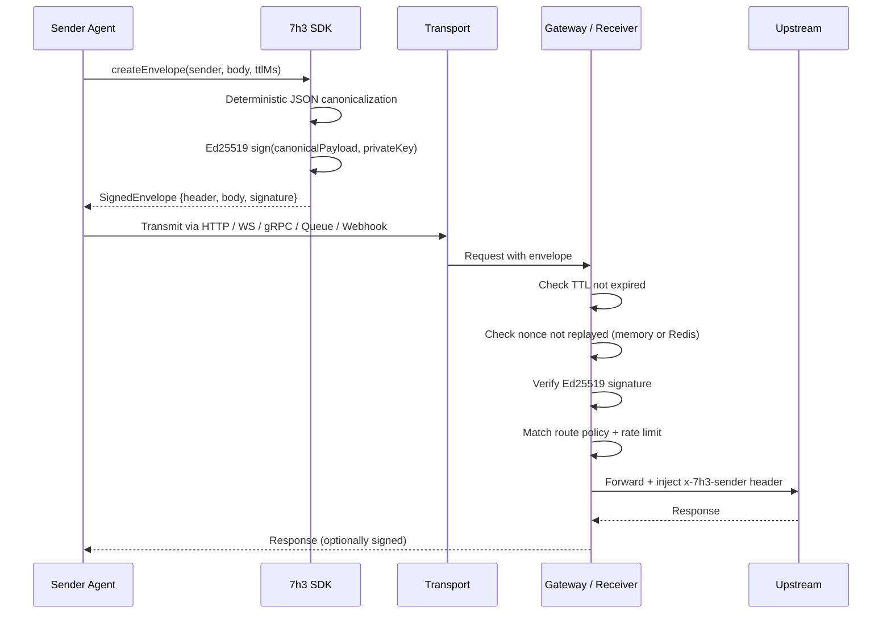
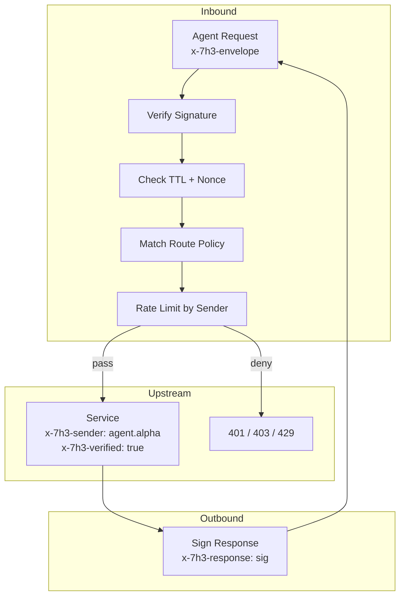
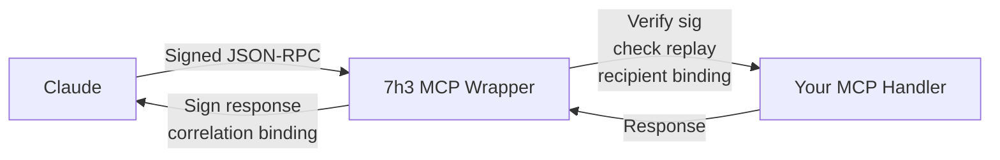
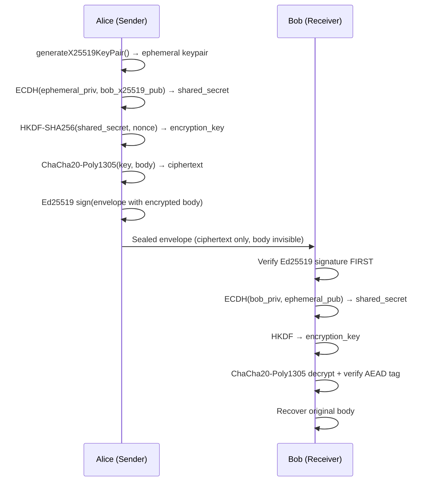
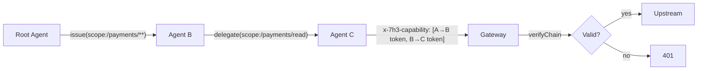
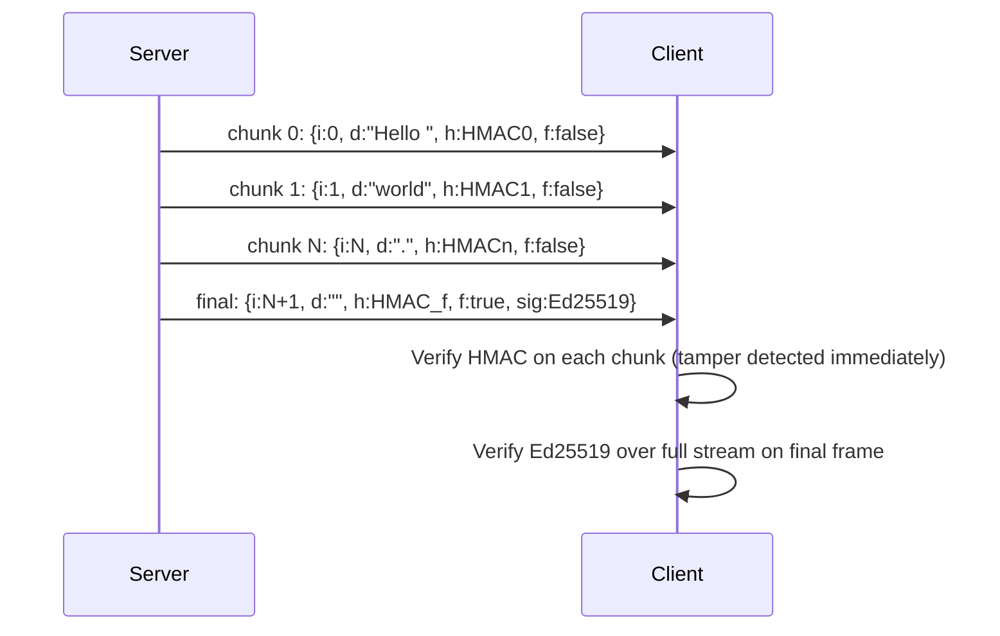
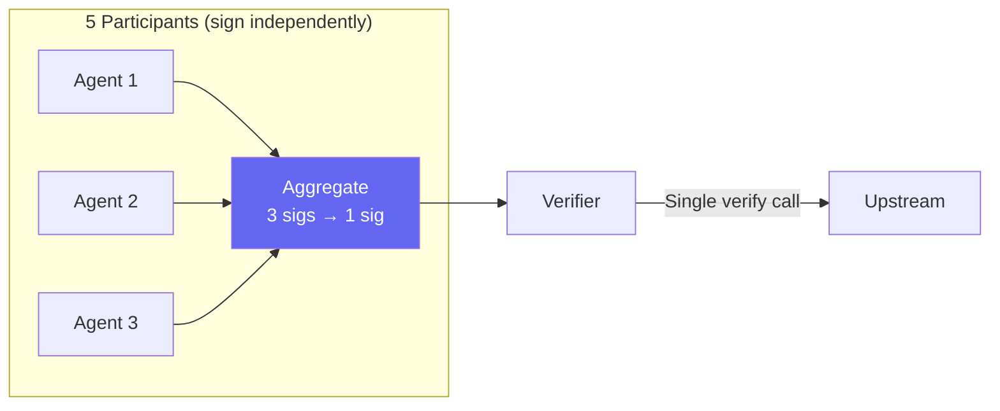
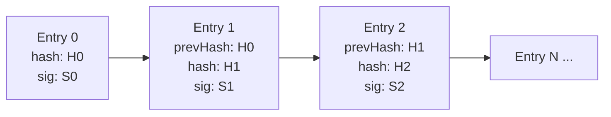

<div align="center">
  

  <br/><br/>

  [](https://www.npmjs.com/package/@7h3/protocol)
  [](https://www.npmjs.com/package/@7h3/protocol-pq)
  [](https://www.npmjs.com/package/@7h3/protocol-threshold)
  [](https://pypi.org/project/7h3-protocol/)
  [](https://crates.io/crates/protocol-7h3)
  [](https://github.com/IceMasterT/7h3-protocol/tree/main/src)
  [](./package.json)
  [](./docs/VERSIONING_POLICY.md)
  [](./LICENSE)

  <br/>

  **Cryptographic signing, replay protection, and E2E encryption for AI agent messages.**
  **One envelope. Every transport. Quantum-ready.**

  <br/>
</div>

---

## Table of Contents

- [The Problem](#the-problem)
- [What 7h3 Protocol Does](#what-7h3-protocol-does)
- [How It Works](#how-it-works)
- [Security Guarantees](#security-guarantees)
- [Installation](#installation)
- [Quick Start](#quick-start)
- [Core API](#core-api)
- [Transports](#transports)
- [Gateway](#gateway)
- [MCP (Claude Tool Calls)](#mcp-claude-tool-calls)
- [End-to-End Encryption](#end-to-end-encryption)
- [Capability Tokens and Delegation](#capability-tokens-and-delegation)
- [Streaming Message Signing](#streaming-message-signing)
- [Distributed Replay Cache (Redis)](#distributed-replay-cache-redis)
- [Binary Wire Format (CBOR)](#binary-wire-format-cbor)
- [Observability (Prometheus + OpenTelemetry)](#observability-prometheus--opentelemetry)
- [Post-Quantum Signatures (ML-DSA)](#post-quantum-signatures-ml-dsa)
- [Threshold Signatures (M-of-N BLS)](#threshold-signatures-m-of-n-bls)
- [Audit Log](#audit-log)
- [Rate Limiting](#rate-limiting)
- [Route Policies](#route-policies)
- [Key Infrastructure](#key-infrastructure)
- [Cross-SDK Conformance](#cross-sdk-conformance)
- [CLI Reference](#cli-reference)
- [Docker](#docker)
- [Uninstall](#uninstall)
- [Changelog](#changelog)

---

## The Problem

AI agent systems are moving fast, and the protocols underpinning them were not built with message-level security in mind.

**MCP (Model Context Protocol)** is plain JSON-RPC 2.0. A message in flight has no signature. Any intermediary — a rogue proxy, a compromised queue consumer, a misconfigured load balancer — can alter tool call parameters or replay a previously captured request. The MCP handler has no way to know.

**A2A (Agent-to-Agent)** signs Agent Cards — static configuration — not per-message traffic. Once an agent is "trusted," every message it sends is implicitly trusted regardless of whether that specific message was tampered with in transit or is a replay from ten minutes ago.

**HTTP APIs** default to IP-based rate limiting. IP addresses are trivially spoofed or shared. The same valid signed request can often be submitted multiple times, triggering duplicate writes, payments, or tool executions.

The gap these protocols share is identical: they authenticate *agents* at the connection or identity level, but they do not authenticate *individual messages* at the content level. 7h3 Protocol fills that gap without replacing anything.

---

## What 7h3 Protocol Does

7h3 Protocol wraps every message — regardless of transport — in a **signed envelope**. The envelope is compact, deterministic, and verifiable by any peer that holds the sender's public key.

**v0.5.0 feature set:**

| Feature | Mechanism |
|---|---|
| Message authentication | Ed25519 asymmetric signing or HMAC-SHA256 |
| Replay prevention | TTL + nonce deduplication (in-memory or Redis) |
| E2E encryption | X25519 key exchange + ChaCha20-Poly1305 AEAD |
| Capability delegation | Scoped, time-bounded, cryptographic credential chains |
| Streaming signing | Per-chunk HMAC + final Ed25519 over the full stream |
| Observability | Zero-dep Prometheus exposition + optional OpenTelemetry |
| Post-quantum | ML-DSA-65 / ML-DSA-87 (NIST FIPS 204) — `@7h3/protocol-pq` |
| Binary encoding | Deterministic CBOR (RFC 8949) — ~40% smaller than JSON |
| Threshold signing | M-of-N BLS12-381 aggregation — `@7h3/protocol-threshold` |
| Transport coverage | HTTP, WebSocket, gRPC, Queues, Webhooks |
| SDK coverage | TypeScript, Python, Rust, Go, Browser |

---

## How It Works

### Canonical Serialization

Signatures only mean something if everyone signs the same bytes. JSON object key order is unspecified by the spec, so 7h3 Protocol uses deterministic JSON canonicalization: keys are sorted alphabetically at every nesting level, optional absent fields are omitted entirely, and the result is UTF-8 encoded.

The canonical form is byte-identical across TypeScript, Python, Rust, and Go, proven by the shared conformance test vectors in `conformance/7h3_v0_1.json`.

### Envelope Structure

```json
{
  "body": {
    "capability":   "task.plan",
    "content":      "do something",
    "correlationId": "req-123",
    "intent":       "TASK"
  },
  "header": {
    "messageId":   "uuid-here",
    "nonce":       "random-bytes",
    "recipient":   "agent.beta",
    "sender":      "agent.alpha",
    "timestampMs": 1712500000000,
    "ttlMs":       60000,
    "version":     "7h3/0.1"
  },
  "signature": {
    "alg":   "ED25519",
    "keyId": "k1",
    "value": "base64url-sig-here"
  }
}
```

Optional fields (`capability`, `correlationId`, `recipient`) are omitted when absent — not `null`, not `""`. This is load-bearing for the canonical form.

### End-to-End Flow



### TTL and Nonce

Every envelope carries `timestampMs`, `ttlMs`, and a random `nonce`. A receiver rejects the envelope if `now > timestampMs + ttlMs`, then checks the nonce against a deduplication store. A replayed envelope fails even if the signature is valid.

---

## Security Guarantees

| Attack | Defense |
|---|---|
| Impersonation | Ed25519 — only the private key holder can produce a valid signature |
| Replay | Nonce deduplication + TTL expiry (in-memory or Redis) |
| Tampering | Signature covers the full canonical envelope; any modification breaks verification |
| Unauthorized access | Per-route `allowedSenders` policy — unlisted senders rejected before upstream |
| Response spoofing | Signed `x-7h3-response` header; `correlationId` binding |
| Rate abuse | `SlidingWindowRateLimiter` keyed by verified sender identity, not IP |
| Audit tampering | `InMemoryAuditLog` entries are Ed25519-signed and chained |
| Quantum computers | ML-DSA-65/87 via `@7h3/protocol-pq` (NIST FIPS 204) |
| Cross-instance replay | `RedisReplayStore` — atomic SET NX PX across all instances |
| Eavesdropping | X25519 + ChaCha20-Poly1305 E2E encryption |

---

## Installation

### TypeScript / Node.js

```bash
npm install @7h3/protocol
# or
pnpm add @7h3/protocol
# or
yarn add @7h3/protocol
```

Requires Node.js ≥ 18. Zero runtime dependencies — uses Node.js built-in `crypto` throughout.

### Python

```bash
pip install 7h3-protocol
```

Requires Python ≥ 3.9. Optional extras for advanced features:

```bash
pip install 7h3-protocol[redis]    # RedisReplayStore (pip install redis)
pip install 7h3-protocol[crypto]   # X25519 + ChaCha20 encryption (pip install cryptography)
pip install 7h3-protocol[pq]       # ML-DSA post-quantum (pip install dilithium-py)
```

### Rust

```toml
# Cargo.toml
[dependencies]
protocol-7h3 = "0.5"
```

### Go

```bash
go get github.com/IceMasterT/7h3-protocol/sdk/go
```

### Browser

```bash
npm install @7h3/protocol-browser
```

Pure Web Crypto API — no Node.js dependency. Works in Chrome 100+, Firefox 100+, Safari 16+, Edge 100+.

### Post-Quantum Extension

```bash
npm install @7h3/protocol-pq
```

Adds ML-DSA-65 and ML-DSA-87 (NIST FIPS 204 / Dilithium). Separate package to keep `@7h3/protocol` at zero runtime dependencies.

### Threshold Signatures Extension

```bash
npm install @7h3/protocol-threshold
```

Adds M-of-N BLS12-381 threshold signatures and Shamir Secret Sharing.

---

## Quick Start

```ts
import {
  generateEd25519KeypairBase64Url,
  createEnvelope,
  signEnvelopeEd25519,
  verifyEnvelopeEd25519,
} from '@7h3/protocol'

// 1. Generate keypairs
const sender   = await generateEd25519KeypairBase64Url()
const receiver = await generateEd25519KeypairBase64Url()

// 2. Create and sign a message
const envelope = createEnvelope('agent.alpha', {
  intent:  'TASK',
  content: 'summarize https://example.com',
}, { ttlMs: 60_000 })

const signed = await signEnvelopeEd25519(envelope, sender.privateKey, 'key-1')

// 3. Transmit `signed` via any transport (HTTP header, WS frame, queue, etc.)

// 4. Verify on the receiving end
const result = await verifyEnvelopeEd25519(signed, sender.publicKey)
if (!result.ok) throw new Error(result.error)

console.log('Verified sender:', signed.header.sender)  // 'agent.alpha'
```

---

## Core API

### Key Generation

**TypeScript:**

```ts
import { generateEd25519KeypairBase64Url } from '@7h3/protocol'

const { publicKey, privateKey } = await generateEd25519KeypairBase64Url()
// publicKey:  SPKI format, base64url, ~44 chars
// privateKey: PKCS8 format, base64url, ~88 chars
```

**Python:**

```python
from protocol_7h3 import generate_keypair

public_key, private_key = generate_keypair()
```

**Rust:**

```rust
use protocol_7h3::generate_keypair;

let (public_key, private_key) = generate_keypair().unwrap();
```

**Go:**

```go
import go7h3 "github.com/IceMasterT/7h3-protocol/sdk/go"

publicKey, privateKey, err := go7h3.GenerateKeypair()
```

**Browser:**

```ts
import { generateKeypair } from '@7h3/protocol-browser'

const { publicKey, privateKey } = await generateKeypair()
```

### Creating Envelopes

```ts
import { createEnvelope } from '@7h3/protocol'

const envelope = createEnvelope(
  'agent.alpha',              // sender ID
  {
    intent:        'TASK',
    content:       'do something',
    capability:    'task.plan',     // optional
    correlationId: 'req-123',       // optional
  },
  {
    ttlMs:     60_000,              // 1 minute (default: 60000)
    recipient: 'agent.beta',        // optional
    messageId: 'custom-uuid',       // optional — auto-generated if omitted
  }
)
```

### Signing

**Ed25519 (asymmetric — recommended):**

```ts
import { signEnvelopeEd25519 } from '@7h3/protocol'

const signed = await signEnvelopeEd25519(envelope, privateKey, 'key-id')
// signed.signature.alg === 'ED25519'
```

**HMAC-SHA256 (shared secret):**

```ts
import { signEnvelopeHmac } from '@7h3/protocol'

const signed = await signEnvelopeHmac(envelope, sharedSecret, 'key-id')
// signed.signature.alg === 'HS256'
```

**Python:**

```python
from protocol_7h3 import sign_envelope_ed25519, sign_envelope_hmac

signed = sign_envelope_ed25519(envelope, private_key, 'k1')
signed = sign_envelope_hmac(envelope, shared_secret, 'k1')
```

**Rust:**

```rust
use protocol_7h3::{sign_envelope_ed25519, sign_envelope_hmac};

let signed = sign_envelope_ed25519(&envelope, &private_key, "k1")?;
let signed = sign_envelope_hmac(&envelope, &shared_secret, "k1")?;
```

**Go:**

```go
signed, err := go7h3.SignEnvelopeEd25519(env, privateKey, "k1")
signed, err := go7h3.SignEnvelopeHmac(env, sharedSecret, "k1")
```

### Verifying

**TypeScript:**

```ts
import { verifyEnvelopeEd25519, verifyEnvelopeHmac } from '@7h3/protocol'

const result = await verifyEnvelopeEd25519(signed, publicKey)
// { ok: true }  or  { ok: false, error: 'TTL expired' | 'signature verification failed' | ... }

const result2 = await verifyEnvelopeHmac(signed, sharedSecret)
```

**Python:**

```python
from protocol_7h3 import verify_envelope_ed25519

result = verify_envelope_ed25519(signed, public_key)
if not result['ok']:
    raise ValueError(result['error'])
```

**Rust:**

```rust
use protocol_7h3::verify_envelope_ed25519;

let result = verify_envelope_ed25519(&signed, &public_key)?;
```

**Go:**

```go
ok, err := go7h3.VerifyEnvelopeEd25519(signed, publicKey)
```

---

## Transports

The same signed envelope is carried differently per transport. Verification logic is identical.

### HTTP / REST

The signed envelope travels as a JSON value in the `x-7h3-envelope` header.

**Signing outbound requests:**

```ts
import { signHttpRequest } from '@7h3/protocol'

const headers = await signHttpRequest({
  method:     'POST',
  url:        'https://api.example.com/action',
  body:       JSON.stringify(payload),
  sender:     'agent.alpha',
  privateKey: myPrivateKey,
  keyId:      'k1',
  intent:     'TASK',
})

await fetch('https://api.example.com/action', {
  method:  'POST',
  headers: { ...headers, 'Content-Type': 'application/json' },
  body:    JSON.stringify(payload),
})
```

**Verifying inbound requests (Express middleware):**

```ts
import { verifyHttpEnvelope } from '@7h3/protocol'

app.use(async (req, res, next) => {
  const result = await verifyHttpEnvelope(req.headers, {
    getPublicKey: async (senderId) => keyStore[senderId],
  })
  if (!result.ok) return res.status(401).json({ error: result.reason })
  req.sender = result.sender
  next()
})
```

**Python:**

```python
from protocol_7h3 import verify_http_envelope, sign_http_request

# Signing
headers = sign_http_request(
    method='POST', url='https://api.example.com/action',
    body=json.dumps(payload), sender='agent.alpha',
    private_key=my_private_key, key_id='k1', intent='TASK'
)

# Verifying (FastAPI/Flask middleware)
result = verify_http_envelope(request.headers, key_registry=key_store)
```

**Go:**

```go
// Middleware
func Middleware(keyRegistry go7h3.KeyRegistry) func(http.Handler) http.Handler {
    return go7h3.Middleware(keyRegistry)
}
```

**CBOR encoding (smaller payloads):**

```ts
const headers = await signHttpRequest({ ...opts, format: 'cbor' })
// Content-Type: application/7h3-cbor
// Payload ~40% smaller
```

### WebSocket

Every frame is individually signed. Sequence numbers prevent reordering attacks.

```ts
import { createWsBinding } from '@7h3/protocol'

const ws = new WebSocket('wss://api.example.com')

// Sender
const binding = createWsBinding(ws, {
  sender:     'agent.alpha',
  privateKey: myPrivateKey,
  keyId:      'k1',
})
binding.send({ intent: 'TASK', content: 'do something' })

// Receiver
const serverBinding = createWsBinding(ws, {
  getPublicKey: async (senderId) => keyStore[senderId],
})
serverBinding.onMessage((envelope) => {
  console.log('Verified from:', envelope.header.sender)
})
```

### gRPC

Envelope in `7h3-envelope-bin` gRPC metadata (binary base64).

```ts
import { grpcSigningInterceptor, grpcVerifyingInterceptor } from '@7h3/protocol'

// Client interceptor
const client = new MyServiceClient(address, credentials, {
  interceptors: [grpcSigningInterceptor({ sender: 'agent.alpha', privateKey, keyId: 'k1' })],
})

// Server interceptor
const server = new grpc.Server()
server.addService(MyService, grpcVerifyingInterceptor({
  implementation: myHandler,
  getPublicKey: async (senderId) => keyStore[senderId],
}))
```

### Message Queues

Envelope wraps payload as `{ envelope, payload }`. Works with SQS, RabbitMQ, Kafka, Pub/Sub.

```ts
import { signQueueMessage, verifyQueueMessage } from '@7h3/protocol'

// Producer
const message = await signQueueMessage(
  { taskId: '123', action: 'process' },
  { sender: 'agent.alpha', privateKey, keyId: 'k1', intent: 'TASK' }
)
await queue.send(JSON.stringify(message))

// Consumer
const result = await verifyQueueMessage(JSON.parse(rawMessage), {
  getPublicKey: async (senderId) => keyStore[senderId],
})
if (result.ok) processTask(result.payload)
```

### Webhooks

Compact `x-7h3-sig` header (HMAC or Ed25519) plus `x-7h3-ts` timestamp.

```ts
import { signWebhook, verifyWebhook } from '@7h3/protocol'

// Sender
const headers = await signWebhook(body, sharedSecret)
// Sets: x-7h3-sig, x-7h3-ts

// Receiver
const result = await verifyWebhook({
  body,
  signature: req.headers['x-7h3-sig'],
  timestamp: req.headers['x-7h3-ts'],
  secret:    webhookSecret,
  maxAgeMs:  300_000,
})
if (!result.ok) return res.status(401).end()
```

---

## Gateway

The `Protocol7h3Gateway` is a reverse proxy that verifies envelopes before forwarding to upstream. Drop it in front of any existing service.

```ts
import { createGateway } from '@7h3/protocol'

const gateway = createGateway({
  upstream:    'http://localhost:3001',
  port:        3000,
  keyRegistry: { getPublicKey: async (id) => keyStore[id] },
  policies: [
    {
      pathGlob:       '/api/admin/**',
      allowedSenders: ['agent.admin'],
      rateLimit:      { maxRequests: 10, windowMs: 60_000 },
    },
    {
      pathGlob:       '/api/**',
      allowedSenders: ['agent.alpha', 'agent.beta'],
      rateLimit:      { maxRequests: 100, windowMs: 60_000 },
    },
  ],
  defaultPolicy: { allowedSenders: [] },  // deny unmatched routes
  signResponses: true,
  privateKey:    gatewayPrivateKey,
  sender:        'gateway',
  metricsPath:   '/metrics',
})

gateway.listen(3000)
```

**Gateway architecture:**



**YAML config (for CLI):**

```yaml
# 7h3.example.yaml
upstream: http://localhost:3001
port: 3000
sender: gateway
metrics_path: /metrics

key_registry:
  agent.alpha: base64url-public-key-here
  agent.beta:  base64url-public-key-here

policies:
  - path_glob: /api/admin/**
    allowed_senders: [agent.admin]
    rate_limit: { max_requests: 10, window_ms: 60000 }
  - path_glob: /api/**
    allowed_senders: [agent.alpha, agent.beta]
    rate_limit: { max_requests: 200, window_ms: 60000 }
```

---

## MCP (Claude Tool Calls)

Claude's tool-calling mechanism is MCP (Model Context Protocol) — plain JSON-RPC 2.0. 7h3 Protocol hardens MCP traffic without any changes to your handler.



**Server side:**

```ts
import { wrapMcpServer, signEnvelopeEd25519 } from '@7h3/protocol'

const secureServer = wrapMcpServer(myMcpHandler, {
  selfAgentId: 'my-mcp-server',
  sign: (e) => signEnvelopeEd25519(e, serverPrivateKey, 'k1'),
  keyRegistry: {
    getPublicKey: async (senderId) => clientPublicKeys[senderId],
  },
})
```

**Client side:**

```ts
import { wrapMcpClient, signEnvelopeEd25519 } from '@7h3/protocol'

const { send } = wrapMcpClient({
  selfAgentId: 'claude-agent',
  peerAgentId: 'my-mcp-server',
  sign: (e) => signEnvelopeEd25519(e, clientPrivateKey, 'k1'),
  receive: {
    signatureResolver: async () => ({ alg: 'ED25519', publicKey: serverPublicKey }),
  },
})

const result = await send({ jsonrpc: '2.0', id: 1, method: 'tools/list' }, fetch)
```

The MCP handler itself is unchanged — zero migration. The wrapper handles all envelope logic at the boundary.

---

## End-to-End Encryption

Signing proves authenticity. Encryption proves privacy. `sealEnvelope` combines both: the body is encrypted before signing so it's opaque to any intermediary, and signature is verified before decryption so tampering fails fast.

Forward secrecy is automatic — a fresh ephemeral X25519 keypair is generated per message.



Zero new dependencies — Node.js built-in `crypto.ecdh` + `crypto.createCipheriv('chacha20-poly1305')`.

**TypeScript:**

```ts
import {
  generateX25519KeyPair,
  sealEnvelope,
  openEnvelope,
} from '@7h3/protocol'

// Each agent needs an Ed25519 signing keypair + an X25519 encryption keypair
const aliceSign = await generateEd25519KeypairBase64Url()
const aliceEnc  = await generateX25519KeyPair()

const bobSign = await generateEd25519KeypairBase64Url()
const bobEnc  = await generateX25519KeyPair()

// Alice seals a message for Bob
const envelope = createEnvelope('alice', { intent: 'TASK', content: 'secret payload' })

const sealed = await sealEnvelope(envelope, {
  recipientX25519PublicKey: bobEnc.publicKey,
  senderEd25519PrivateKey:  aliceSign.privateKey,
})
// sealed.body.intent === 'ENCRYPTED'
// sealed.body.content is the encrypted blob — opaque to any eavesdropper

// Bob opens it
const { body } = await openEnvelope(sealed, {
  recipientX25519PrivateKey: bobEnc.privateKey,
  senderEd25519PublicKey:    aliceSign.publicKey,
})
// body.content === 'secret payload'
```

**Python:**

```python
from protocol_7h3.encryption import generate_x25519_keypair, seal_envelope, open_envelope

alice_enc_pub, alice_enc_priv = generate_x25519_keypair()
bob_enc_pub,   bob_enc_priv   = generate_x25519_keypair()

sealed = seal_envelope(envelope, bob_enc_pub, alice_sign_priv)
body   = open_envelope(sealed, bob_enc_priv, alice_sign_pub)
```

**Go:**

```go
bobPub, bobPriv, _ := go7h3.GenerateX25519KeyPair()

sealed, _       := go7h3.SealEnvelope(env, bobPub, alicePriv)
env, body, _    := go7h3.OpenEnvelope(sealed, bobPriv, alicePub)
```

---

## Capability Tokens and Delegation

Capability tokens let one agent grant another scoped, time-bounded, cryptographically verifiable authority — without sharing keys.

**Example:** service A grants service B permission to call `/api/payments/**` for 5 minutes. B can delegate a narrower scope to C. Any receiver can verify the full A → B → C chain.



**Issue a token:**

```ts
import { issueCapabilityToken } from '@7h3/protocol'

const token = await issueCapabilityToken({
  issuerPrivateKey: rootPrivateKey,
  issuerId:         'root-agent',
  subject:          'agent.worker',
  scopes: [
    { pathGlob: '/api/payments/**', methods: ['POST'], maxDelegations: 1 },
  ],
  ttlMs:          300_000,   // 5 minutes
  maxDelegations: 1,         // one more delegation hop allowed
})
```

**Delegate a narrower scope:**

```ts
import { delegateCapabilityToken } from '@7h3/protocol'

const delegation = await delegateCapabilityToken({
  parentToken:         token,
  delegatorPrivateKey: workerPrivateKey,
  delegatorId:         'agent.worker',
  newSubject:          'agent.subworker',
  scopes: [
    { pathGlob: '/api/payments/read', methods: ['GET'] },  // must be ⊆ parent
  ],
  ttlMs: 60_000,   // must not exceed parent's remaining TTL
})
```

**Attach to HTTP request:**

```ts
import { serializeCapabilityChain, CAP_HEADER } from '@7h3/protocol'

const headers = {
  [CAP_HEADER]: serializeCapabilityChain([token, delegation]),
  // x-7h3-capability: [base64-token-1, base64-token-2]
}
```

**Verify a chain:**

```ts
import { verifyCapabilityChain } from '@7h3/protocol'

const result = await verifyCapabilityChain(
  chain,
  { getPublicKey: async (id) => keyStore[id] },
  { requiredPathGlob: '/api/payments/read', requiredMethod: 'GET' }
)
// { ok: true, token, chain }  or  { ok: false, reason: '...' }
```

---

## Streaming Message Signing

LLM outputs are streams of tokens. 7h3 Streaming Signing gives each chunk a per-chunk HMAC and seals the entire stream with a final Ed25519 signature over the full content hash. Clients detect tampering mid-stream.



**Writing a signed stream:**

```ts
import { SignedStreamWriter } from '@7h3/protocol'

const writer = new SignedStreamWriter({
  privateKey: serverPrivateKey,
  sender:     'llm.server',
  keyId:      'k1',
})

for await (const token of llmTokenStream) {
  const chunk = await writer.writeChunk(token)
  ws.send(JSON.stringify(chunk))
}
ws.send(JSON.stringify(await writer.finalize()))
```

**Reading and verifying:**

```ts
import { SignedStreamReader } from '@7h3/protocol'

const reader = new SignedStreamReader({ publicKey: serverPublicKey })

ws.on('message', async (raw) => {
  const chunk = JSON.parse(raw)
  if (!chunk.f) {
    const r = await reader.receiveChunk(chunk)
    if (!r.ok) throw new Error(`Chunk ${chunk.i} tampered: ${r.reason}`)
    appendToUI(chunk.d)
  } else {
    const result = await reader.finalize(chunk)
    if (!result.ok) throw new Error(result.reason)
    console.log(`Stream verified — ${result.chunkCount} chunks, ${result.totalBytes} bytes`)
  }
})
```

**Convenience wrappers for complete arrays:**

```ts
import { signStream, verifyStream } from '@7h3/protocol'

const chunks = await signStream(
  ['Hello ', 'world', '.'],
  { privateKey, sender: 'llm', keyId: 'k1' }
)

const result = await verifyStream(chunks, { publicKey })
// { ok: true, totalBytes: 12, chunkCount: 3 }
```

**WebSocket integration:**

```ts
import { createSignedWebSocketStream, receiveSignedWebSocketStream } from '@7h3/protocol'

// Server side
const writer = await createSignedWebSocketStream(ws, { privateKey, sender: 'llm', keyId: 'k1' })

// Client side
const result = await receiveSignedWebSocketStream(ws, { publicKey })
```

---

## Distributed Replay Cache (Redis)

The default in-memory replay cache breaks in multi-instance deployments. A replayed nonce can slip through between two gateway instances. Use `RedisReplayStore` in production.

```ts
import { createRedisReplayStore } from '@7h3/protocol'

const replayStore = createRedisReplayStore({ redisUrl: 'redis://localhost:6379' })

const gateway = createGateway({ ...opts, replayStore })
```

**Redis Cluster (queries all nodes — a nonce is seen if ANY node has it):**

```ts
import { createClusterReplayStore } from '@7h3/protocol'

const replayStore = createClusterReplayStore([
  'redis://node-1:6379',
  'redis://node-2:6379',
  'redis://node-3:6379',
])
```

**Inject your own Redis client:**

```ts
import { RedisReplayStore } from '@7h3/protocol'
import { createClient } from 'redis'

const client = createClient({ url: 'redis://localhost:6379' })
await client.connect()

const replayStore = new RedisReplayStore({ client })
// RedisClientLike: any client implementing set(k, v, opts) + get(k)
// Works with ioredis, redis, @upstash/redis
```

**Python:**

```python
from protocol_7h3.replay import create_redis_replay_store

store = create_redis_replay_store('redis://localhost:6379')
```

**Go:**

```go
store := go7h3.NewRedisReplayStore("7h3:nonce:", func(ctx context.Context, key string, ttl time.Duration) (bool, error) {
    return redisClient.SetNX(ctx, key, "1", ttl).Result()
})
```

---

## Binary Wire Format (CBOR)

CBOR (RFC 8949 deterministic mode) produces ~40% smaller payloads compared to JSON. Uses numeric field keys for maximum compactness.

```ts
import { encodeEnvelopeCbor, decodeEnvelopeCbor, CBOR_CONTENT_TYPE } from '@7h3/protocol'

// Encode
const bytes: Uint8Array = encodeEnvelopeCbor(signedEnvelope)
// bytes.length ≈ 60% of JSON.stringify(signedEnvelope).length

// Decode
const envelope = decodeEnvelopeCbor(bytes)

// HTTP
await fetch(url, {
  method:  'POST',
  headers: { 'Content-Type': CBOR_CONTENT_TYPE },  // 'application/7h3-cbor'
  body:    bytes,
})
```

**General-purpose CBOR (zero runtime deps):**

```ts
import { encodeCbor, decodeCbor } from '@7h3/protocol'

const bytes = encodeCbor({ any: 'value', nested: [1, 2, 3], ok: true })
const value = decodeCbor(bytes)
```

**Go:**

```go
bytes, err := go7h3.EncodeEnvelopeCBOR(env)
env, err   := go7h3.DecodeEnvelopeCBOR(bytes)
```

---

## Observability (Prometheus + OpenTelemetry)

### Prometheus Metrics

Zero new dependencies — implements the Prometheus exposition format from scratch.

```ts
import { metrics, renderPrometheusText, createMetricsMiddleware } from '@7h3/protocol'

// Serve /metrics on your existing Express app
app.use(createMetricsMiddleware('/metrics'))

// Or render manually
app.get('/metrics', (req, res) => {
  res.set('Content-Type', 'text/plain; version=0.0.4')
  res.send(renderPrometheusText(metrics))
})
```

**Available metrics:**

| Metric | Type | Labels |
|---|---|---|
| `7h3_verifications_total` | counter | `result` (ok\|fail), `alg`, `transport` |
| `7h3_verification_duration_ms` | histogram | — |
| `7h3_rate_limit_hits_total` | counter | `sender`, `path` |
| `7h3_sender_denials_total` | counter | `sender`, `path` |
| `7h3_replay_detections_total` | counter | `transport` |
| `7h3_audit_entries_total` | counter | `type` |
| `7h3_active_connections` | counter | `transport` |

**CLI gateway:**

```bash
7h3 gateway --config 7h3.example.yaml --metrics-port 9090
# http://localhost:9090/metrics
```

### OpenTelemetry

No hard dependency — inject any OTel-compatible SDK:

```ts
import { setOtelProvider } from '@7h3/protocol'
import { trace } from '@opentelemetry/api'

setOtelProvider(trace.getTracerProvider())
// Spans emitted automatically for each verification:
// Span name: '7h3.verify', attributes: messageId, sender, alg, result
```

---

## Post-Quantum Signatures (ML-DSA)

Ed25519 is broken by a sufficiently large quantum computer. ML-DSA (Dilithium, NIST FIPS 204, 2024) is the standardized post-quantum signature algorithm. `@7h3/protocol-pq` is a drop-in replacement for the signing functions — same envelope format, different `alg` field.

```ts
import { generatePqKeyPair, signEnvelopePq, verifyEnvelopePq } from '@7h3/protocol-pq'
import { createEnvelope } from '@7h3/protocol'

// Generate a post-quantum keypair
const { publicKey, privateKey, algorithm } = generatePqKeyPair('ML-DSA-65')
// publicKey: 1,952 bytes, base64url

// Sign (same envelope format)
const envelope = createEnvelope('agent.alpha', { intent: 'TASK', content: 'hello' })
const signed   = await signEnvelopePq(envelope, privateKey, 'ML-DSA-65')
// signed.signature.alg === 'ML-DSA-65'

// Verify
const ok = await verifyEnvelopePq(signed, publicKey)
```

| Algorithm | NIST Level | Public key | Signature size |
|---|---|---|---|
| `ML-DSA-44` | 2 (128-bit post-quantum) | 1,312 bytes | 2,420 bytes |
| `ML-DSA-65` | 3 (192-bit post-quantum) | 1,952 bytes | 3,293 bytes |
| `ML-DSA-87` | 5 (256-bit post-quantum) | 2,592 bytes | 4,595 bytes |

**Python:**

```python
from protocol_7h3.pq import generate_ml_dsa_keypair, sign_envelope_pq, verify_envelope_pq

pub, secret = generate_ml_dsa_keypair(level=65)
signed      = sign_envelope_pq(envelope, secret, level=65)
ok          = verify_envelope_pq(signed, pub, level=65)
```

---

## Threshold Signatures (M-of-N BLS)

High-stakes operations require M of N agents to co-sign before a message is valid. BLS12-381 aggregation: M agents sign independently, any party combines the M signatures into one, any verifier checks it with a single verify call identical to a regular verify.



```ts
import {
  generateBlsKeyPair,
  signEnvelopeBls,
  aggregateSignatures,
  verifyThresholdEnvelope,
} from '@7h3/protocol-threshold'

// Setup: 5 participants, require 3 to sign
const keys   = Array.from({ length: 5 }, () => generateBlsKeyPair())
const config = { m: 3, n: 5 }

// Create the envelope (unsigned)
const envelope = createEnvelope('council', { intent: 'TASK', content: 'deploy v2' })

// Any 3 participants sign independently — order doesn't matter
const partial1 = await signEnvelopeBls(envelope, keys[0].privateKey, 'agent-1')
const partial2 = await signEnvelopeBls(envelope, keys[1].privateKey, 'agent-2')
const partial3 = await signEnvelopeBls(envelope, keys[2].privateKey, 'agent-3')

// Any party aggregates the 3 partial signatures
const publicKeys = {
  'agent-1': keys[0].publicKey,
  'agent-2': keys[1].publicKey,
  'agent-3': keys[2].publicKey,
}
const thresholdEnvelope = await aggregateSignatures(
  [partial1, partial2, partial3],
  publicKeys,
  envelope,
  config,
)

// Verifier performs a single verify call
const allPublicKeys = Object.fromEntries(keys.map((k, i) => [`agent-${i+1}`, k.publicKey]))
const ok = await verifyThresholdEnvelope(thresholdEnvelope, allPublicKeys, config)
```

**Shamir Secret Sharing** — split one master BLS key into N shares; any M reconstruct it:

```ts
import { splitPrivateKey, reconstructPrivateKey } from '@7h3/protocol-threshold'

const masterKey = generateBlsKeyPair().privateKey
const shares    = splitPrivateKey(masterKey, 3, 5)   // split into 5 shares, need 3

// Distribute shares to 5 participants.
// Later, any 3 combine their shares to reconstruct the master key:
const recovered = reconstructPrivateKey([shares[0], shares[2], shares[4]], 3)
// recovered === masterKey
```

---

## Audit Log

Every verification event is logged with an Ed25519-signed entry. Entries form a tamper-evident chain — altering any entry breaks all subsequent entries.

```ts
import { createAuditLog } from '@7h3/protocol'

const log = createAuditLog({ privateKey: auditPrivateKey, keyId: 'audit-k1' })

// Gateway writes entries automatically.
// You can also write manually:
await log.write({
  type:      'verify',
  sender:    'agent.alpha',
  messageId: 'msg-1',
  result:    'ok',
  transport: 'http',
})

// Read entries
const entries = log.entries()

// Verify the full chain
const valid = await log.verifyChain()
// valid === true; false if any entry was tampered
```

**Chain structure:**



---

## Rate Limiting

`SlidingWindowRateLimiter` is keyed by verified sender identity, not IP. VPN and NAT do not grant extra quota.

```ts
import { SlidingWindowRateLimiter } from '@7h3/protocol'

const limiter = new SlidingWindowRateLimiter({ maxRequests: 100, windowMs: 60_000 })

const result = limiter.check('agent.alpha')
// { allowed: true, remaining: 99, resetAt: 1712500060000 }
// { allowed: false, remaining: 0, retryAfter: 45000 }
```

---

## Route Policies

Glob-matched path policies enforce sender allowlists per route.

```ts
import { matchPolicy, isAllowedSender } from '@7h3/protocol'

const policies = [
  { pathGlob: '/api/admin/**', allowedSenders: ['agent.admin'] },
  { pathGlob: '/api/**',       allowedSenders: ['agent.alpha', 'agent.beta'] },
]

const matched = matchPolicy(req.path, policies)
if (matched && !isAllowedSender(verifiedSender, matched)) {
  return res.status(403).json({ error: 'sender not authorized' })
}
```

**Glob rules:**

| Pattern | Matches |
|---|---|
| `**` | Any number of path segments (including `/`) |
| `*` | Any characters within a single segment |
| `?` | Any single character |

---

## Key Infrastructure

### Static Registry

```ts
import { createStaticKeyRegistry } from '@7h3/protocol'

const registry = createStaticKeyRegistry({
  'agent.alpha': 'base64url-public-key',
  'agent.beta':  'base64url-public-key',
})
```

### Caching Registry (remote keys with TTL)

```ts
import { createCachingKeyRegistry } from '@7h3/protocol'

const registry = createCachingKeyRegistry(
  async (senderId) => {
    const res = await fetch(`https://keys.example.com/${senderId}`)
    return (await res.json()).publicKey
  },
  { ttlMs: 300_000 }
)
```

### Key Rotation

```ts
import { createKeyRotator } from '@7h3/protocol'

const rotator = createKeyRotator({
  generateKey:           () => generateEd25519KeypairBase64Url(),
  rotationIntervalMs:    86_400_000,   // daily
  onNewKey: async (keypair, keyId) => {
    await publishPublicKey(keyId, keypair.publicKey)
  },
})
```

---

## Cross-SDK Conformance

All SDKs produce byte-identical canonical JSON. The shared conformance vector:

```json
{
  "body":   { "capability":"task.plan","content":"route:alpha->beta","correlationId":"corr-1","intent":"TASK" },
  "header": { "messageId":"vec-1","nonce":"nonce-vec-1","recipient":"agent.beta","sender":"agent.alpha","timestampMs":1712500000000,"ttlMs":60000,"version":"7h3/0.1" }
}
```

Each SDK verifies this exact byte sequence in its test suite. See `conformance/7h3_v0_1.json` for the complete vector set.

---

## CLI Reference

```bash
# Install globally
npm install -g @7h3/protocol

# Generate a keypair
7h3 keygen
# publicKey:  MCowBQ...
# privateKey: MIGHAgE...

# Sign a message
7h3 sign \
  --private-key <base64url-key> \
  --sender agent.alpha \
  --content "hello world" \
  --intent TASK

# Verify an envelope (reads from stdin)
7h3 verify --public-key <base64url-key> < envelope.json

# Inspect an envelope without verifying
7h3 inspect < envelope.json

# Run the gateway
7h3 gateway --config 7h3.example.yaml

# Run the gateway with metrics
7h3 gateway --config 7h3.example.yaml --metrics-port 9090

# Serve a key registry
7h3 keys serve \
  --keys "agent.alpha=<pubkey>,agent.beta=<pubkey>" \
  --port 3010
```

---

## Docker

```bash
# Pull
docker pull ghcr.io/icemastert/7h3-protocol:latest

# Run gateway
docker run -p 3000:3000 \
  -v $(pwd)/7h3.example.yaml:/app/7h3.yaml \
  ghcr.io/icemastert/7h3-protocol \
  7h3 gateway --config /app/7h3.yaml
```

**`docker-compose.yaml` (included in repo):**

```yaml
services:
  gateway:
    build: .
    ports:
      - "3000:3000"
      - "9090:9090"
    command: 7h3 gateway --config /app/7h3.yaml --metrics-port 9090
    volumes:
      - ./7h3.example.yaml:/app/7h3.yaml

  redis:
    image: redis:7-alpine
    ports:
      - "6379:6379"
```

---

## Uninstall

```bash
# npm
npm uninstall @7h3/protocol @7h3/protocol-pq @7h3/protocol-threshold

# Python
pip uninstall 7h3-protocol

# Rust — remove from Cargo.toml, then:
cargo update

# Go
go mod edit -droprequire github.com/IceMasterT/7h3-protocol/sdk/go
go mod tidy
```

---

## Changelog

### v0.5.0

- **Redis replay cache** — `RedisReplayStore` / `ClusterRedisReplayStore` (atomic SET NX PX); injectable `RedisClientLike` interface; Go + Python SDKs
- **E2E encryption** — `sealEnvelope` / `openEnvelope` (X25519 + ChaCha20-Poly1305); ephemeral keypairs for forward secrecy; zero new deps; Python + Go SDKs
- **Capability tokens** — `issueCapabilityToken` / `delegateCapabilityToken` / `verifyCapabilityChain`; `x-7h3-capability` gateway header; glob-matched scope enforcement
- **Streaming signing** — `SignedStreamWriter` / `SignedStreamReader`; per-chunk HMAC + final Ed25519; WebSocket integration; `signStream` / `verifyStream` convenience API
- **Prometheus + OpenTelemetry** — zero-dep Prometheus text format; `createMetricsMiddleware`; CLI `--metrics-port`; optional OTel provider injection
- **Post-quantum** — `@7h3/protocol-pq`: ML-DSA-65 and ML-DSA-87 via `@noble/post-quantum`; Python via `dilithium-py`
- **CBOR** — zero-dep deterministic CBOR encoder/decoder (RFC 8949); `encodeEnvelopeCbor` / `decodeEnvelopeCbor`; HTTP CBOR binding; Go SDK
- **Threshold signatures** — `@7h3/protocol-threshold`: BLS12-381 M-of-N via `@noble/curves`; Shamir `splitPrivateKey` / `reconstructPrivateKey`

### v0.4.0

- API Gateway (`Protocol7h3Gateway`) with per-route policies, rate limiting, signed responses
- Go SDK (pure stdlib)
- Browser SDK (pure Web Crypto API)
- CLI (`7h3 keygen`, `sign`, `verify`, `inspect`, `gateway`, `keys serve`)
- Tamper-evident audit log (`InMemoryAuditLog`, Ed25519-signed chain)
- gRPC transport binding
- Dockerized gateway

### v0.3.0

- Python SDK — signing, verifying, conformance vectors
- Rust SDK — signing, verifying, canonical serialization
- Queue and Webhook transport bindings
- MCP wrapper (`wrapMcpServer`, `wrapMcpClient`)

### v0.2.0

- Renamed from `aip7h3` to `7h3-protocol` / `@7h3/protocol`
- WebSocket binding with sequence number protection
- Sliding window rate limiter keyed by verified sender
- Per-route policy engine with glob matching

### v0.1.0

- Core protocol: `createEnvelope`, `signEnvelopeEd25519`, `verifyEnvelopeEd25519`, `signEnvelopeHmac`, `verifyEnvelopeHmac`
- HTTP transport binding
- TypeScript SDK, zero runtime dependencies
- Canonical JSON serialization, cross-platform byte-identical

---

<div align="center">
  <sub>Wire version <code>7h3/0.1</code> is immutable — all v0.x releases are backwards-compatible at the wire level.</sub><br/>
  <sub>MIT License © 2024–2026 IceMasterT</sub>
</div>
