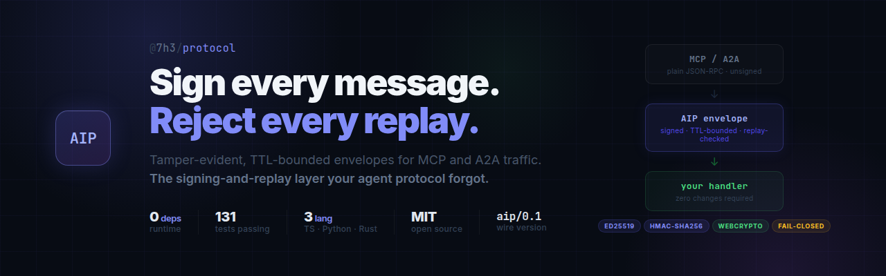

<div align="center">
  

  <br/><br/>

  [](https://www.npmjs.com/package/@7h3/protocol)
  [](https://www.npmjs.com/package/@7h3/protocol-mcp)
  [](https://pypi.org/project/aip7h3/)
  [](https://crates.io/crates/aip7h3)
  [](https://github.com/IceMasterT/7h3-protocol-aip/tree/main/src)
  [](./package.json)
  [](./tsconfig.json)
  [](./LICENSE)
  [](./docs/VERSIONING_POLICY.md)

  <br/>

  **The signing-and-replay layer your agent protocol forgot.**

  <br/>
</div>

---

## Why it exists

The dominant agent protocols ship messages unsigned:

- **MCP** uses plain JSON-RPC 2.0 — no signatures, no replay protection. Parameters can be altered in transit; valid messages can be replayed indefinitely.
- **A2A** signs *Agent Cards* for domain identity — but not the per-message task traffic.

AIP fills exactly that gap. It is a hardening envelope you put *around* MCP or A2A traffic — not a competitor to them. Every message gets signed, TTL-bounded, and replay-checked before it reaches your handler.

Use it when agents trigger real side effects (writes, payments, tool calls) and you need tamper-evidence, replay-safety, and auditability.

---

## Guarantees

| Property | Mechanism |
|---|---|
| **Authentic** | HMAC-SHA256 (HS256) or Ed25519 over a canonical payload — real WebCrypto, no hand-rolled crypto |
| **Deterministic** | Fixed-key-order canonicalization; signatures match byte-for-byte across TS / Python / Rust |
| **Replay-resistant** | `(sender, messageId, nonce)` uniqueness window + TTL / clock-skew enforcement |
| **Polyglot** | Shared conformance fixture set (`conformance/aip_v0_1.json`) proves parity across all three runtimes |

---

## Install

```bash
npm install @7h3/protocol
```

Python and Rust SDKs live under `sdk/python` (`from aip7h3 import …`) and `sdk/rust` (`use aip7h3::…`).

### MCP server (for Claude Code / Claude Desktop)

The companion `@7h3/protocol-mcp` package installs five tools into your AI assistant for generating secrets, keypairs, and boilerplate.

```bash
# Claude Code
claude mcp add aip -- npx @7h3/protocol-mcp
```

```json
// Claude Desktop — claude_desktop_config.json
{
  "mcpServers": {
    "aip": { "command": "npx", "args": ["@7h3/protocol-mcp"] }
  }
}
```

| Tool | What it does |
|---|---|
| `aip_generate_secret` | 32-byte HMAC secret → `AIP_SECRET` |
| `aip_generate_keypair` | Ed25519 keypair → env vars |
| `aip_wrap_mcp_server` | Ready-to-paste boilerplate for your MCP server |
| `aip_sign` | Sign a test envelope (debugging / fixture generation) |
| `aip_verify` | Verify an envelope's signature and shape |

---

## Quick start

### HMAC (shared secret — simplest path)

```ts
import {
  createEnvelope, signEnvelopeHmac, verifyEnvelopeHmac, validateEnvelope,
} from '@7h3/protocol'

const secret = 'shared-secret'
const envelope = await signEnvelopeHmac(
  createEnvelope({ sender: 'planner', recipient: 'worker', intent: 'TASK', content: 'do-the-thing' }),
  secret,
)

const diagnostics = validateEnvelope(envelope)        // shape / TTL / version checks
const ok = await verifyEnvelopeHmac(envelope, secret) // tamper + auth check
// → replay-check downstream via your transport's replay cache
```

### Ed25519 (asymmetric — production recommendation)

> **Why Ed25519?** HMAC is a shared secret — any peer that can verify can also forge. Ed25519 is asymmetric: you sign with a private key, peers verify with your public key only. Compromising a peer does not compromise your signing key.

```ts
import {
  generateEd25519KeypairBase64Url, createEnvelope,
  signEnvelopeEd25519, verifyEnvelopeEd25519,
} from '@7h3/protocol'

const { privateKey, publicKey } = await generateEd25519KeypairBase64Url()
const envelope = await signEnvelopeEd25519(
  createEnvelope({ sender: 'planner', recipient: 'worker', intent: 'TASK', content: 'do-the-thing' }),
  privateKey, 'k1',
)
const ok = await verifyEnvelopeEd25519(envelope, publicKey)
```

---

## MCP hardening wrapper

Wrap any existing MCP server or client — handler signature does not change:

```ts
import { wrapMcpServer, wrapMcpClient, signEnvelopeEd25519 } from '@7h3/protocol'

// Server side
const secureServer = wrapMcpServer(myMcpHandler, {
  selfAgentId: 'my-server',
  sign: (e) => signEnvelopeEd25519(e, serverPrivateKey, 'k1'),
})

// Client side
const { send } = wrapMcpClient({
  selfAgentId: 'my-client',
  peerAgentId: 'my-server',
  sign: (e) => signEnvelopeEd25519(e, clientPrivateKey, 'k1'),
  receive: { signatureResolver: async ({ keyId }) => ({ alg: 'ED25519', publicKey: serverPublicKey }) },
})
const response = await send({ jsonrpc: '2.0', id: 1, method: 'tools/list' }, fetch)
```

The wrapper enforces four bindings beyond signature verification:

| Binding | Attack defeated |
|---|---|
| **Recipient** | Server rejects envelopes not addressed to `selfAgentId` — cross-server relay |
| **Sender** | Client accepts responses only from `peerAgentId` — response spoofing |
| **Correlation** | Client enforces `correlationId === request messageId` — response substitution |
| **Replay** | `InMemoryReplayCache` injected by default — replay of prior requests |

Demo: `npm run aip:mcp:wrap`

---

## Wire formats

Three formats — choose by context:

| Format | Use case |
|---|---|
| `json` | Human-readable, debug-friendly |
| `compact` | Minified JSON — smaller over HTTP |
| `binary` | MessagePack (magic `AIPB`) — highest throughput, lowest parse overhead |

```ts
import { encodeEnvelope, decodeEnvelope } from '@7h3/protocol'

const wire = encodeEnvelope(envelope, 'binary')   // Uint8Array
const back = decodeEnvelope(wire)                  // ProtocolEnvelope
```

---

## Distributed replay store (Redis)

Production deployments need a shared replay store across agent instances:

```ts
import { createRedisReplayStore, DistributedReplayCache } from '@7h3/protocol'

const store = createRedisReplayStore(redisClient, {
  errorBehavior: 'fallback', // degrade to local store on Redis outage — never silent
  onDegraded: (err) => telemetry.error('replay-store-degraded', err),
})
const replayCache = new DistributedReplayCache(store)

// Pass replayCache into receiveEnvelope or wrapMcpServer/wrapMcpClient
```

- Atomic `SET NX PX` reserve — no double-processing under concurrent writes
- `reserveMany` batch pipeline — low overhead for high-volume handlers
- `errorBehavior: 'fallback' | 'reject' | 'allow'` — operator controls degradation posture
- See `docs/DISTRIBUTED_REPLAY.md`

---

## Fleet-wide key revocation

```ts
import { createRedisRevocationStore, withRevocationCheck } from '@7h3/protocol'

const revocationStore = createRedisRevocationStore(redisClient) // fail-closed default
const secureResolver = withRevocationCheck(mySignatureResolver, revocationStore)
// Revoked key → resolver returns undefined → verification fails
```

- Cached reads (5 s TTL by default) — low overhead on the verify hot path
- Fail-closed default: Redis outage → reject, not allow
- See `docs/KEY_REVOCATION.md`

---

## Transport adapters

Zero new runtime dependencies — only Node built-ins and global `fetch`:

```ts
import { serveMcpOverStdio, createStdioMcpClient } from '@7h3/protocol'
import { createHttpMcpHandler, createHttpMcpClient } from '@7h3/protocol'
```

| Adapter | Notes |
|---|---|
| `serveMcpOverStdio` + `createStdioMcpClient` | Newline-delimited; in-order sequential chain prevents response interleaving |
| `createHttpMcpHandler` + `createHttpMcpClient` | `node:http` handler + `fetch` client; supports `binary` wire format |

---

## Framework adapters

LangChain, LlamaIndex, and JSON-RPC bridge adapters wrap `AipAgentAdapter` to translate between AIP envelopes and framework-native message types:

```ts
import { LangChainAipAdapter, LlamaIndexAipAdapter, JsonRpcBridge } from '@7h3/protocol'
```

---

## Policy and telemetry

Runtime policy controls transport behavior, retry, rate limits, and safety invariants — loaded from `AI_RUNTIME_POLICY.yaml` or inline:

```ts
import { loadRuntimePolicy, validateRuntimePolicy, PolicyEnforcer } from '@7h3/protocol'

const policy = await loadRuntimePolicy({ path: './AI_RUNTIME_POLICY.yaml' })
const enforcer = new PolicyEnforcer(policy)
```

See `docs/TELEMETRY.md`, `docs/AI_DECISION_CARD.md`, `docs/OPERATORS.md`.

---

## Polyglot parity

All three SDKs are driven by the same conformance fixture set at `conformance/aip_v0_1.json`. Signatures verified against known vectors in all three runtimes:

```bash
npm test                          # TypeScript (131 tests / 23 files)
npm run conformance:python        # Python unittest
npm run conformance:rust          # Rust cargo test (7 tests)
```

---

## Status

**Version: 0.1.2** · Wire protocol: `aip/0.1`

| What | Status |
|---|---|
| Core test suite | ✅ 131 tests / 23 files — all green |
| Cryptography | ✅ Real WebCrypto — HMAC-SHA256 + Ed25519 (no hand-rolled crypto) |
| Deterministic canonicalization | ✅ Fixed key order; byte-identical across runtimes |
| TS/Python/Rust parity | ✅ Shared conformance fixtures; all pass |
| Distributed replay (Redis) | ✅ Atomic `SET NX PX`; batch pipeline; graceful degradation |
| Fleet-wide revocation (Redis) | ✅ Fail-closed; cached reads; stale-serve during outage |
| MCP hardening wrapper | ✅ 4 bindings; all independently tested |
| Property-based fuzz tests | ✅ 8 properties via fast-check (wire decoder, canonicalization, replay) |
| Live-Redis integration test | ✅ Auto-skips if no server present — no false passes |
| Formal fuzz campaign | ✅ TypeScript mutation harnesses run clean (50k/20k rounds, 0 crashes); Rust targets built and run (4.9M iterations, no panics in `canonicalize_envelope`/`decode_envelope`) — see [`docs/FUZZ_CAMPAIGN.md`](./docs/FUZZ_CAMPAIGN.md) |
| Independent security audit | ⚠️ Not yet performed by an external reviewer — internal AI-assisted review completed 2026-06-05, 2 bugs found and fixed (see [`docs/SECURITY_REVIEW_2026-06-05.md`](./docs/SECURITY_REVIEW_2026-06-05.md)); cryptographic primitives are standard WebCrypto; parsing/replay/canonicalization logic remains unaudited by a qualified third party |
| Python Ed25519 | ✅ Pure-Python fallback — no external packages required; tries `cryptography` → `PyNaCl` → pure Python in order |
| Rust crates.io publish | ✅ Metadata complete; `cargo publish --dry-run` passes — publish with `cargo publish` when ready |
| Redis HA | ✅ Sentinel, Cluster, and Upstash adapter patterns documented in [`docs/DISTRIBUTED_REPLAY.md`](./docs/DISTRIBUTED_REPLAY.md) |

---

## Docs

| Document | Contents |
|---|---|
| [`docs/THREAT_MODEL.md`](./docs/THREAT_MODEL.md) | Full threat coverage matrix |
| [`docs/MCP_WRAPPER.md`](./docs/MCP_WRAPPER.md) | MCP wrapper usage, transport examples, HMAC vs Ed25519 comparison |
| [`docs/DISTRIBUTED_REPLAY.md`](./docs/DISTRIBUTED_REPLAY.md) | Redis store setup, `errorBehavior` table, ops guidance |
| [`docs/KEY_REVOCATION.md`](./docs/KEY_REVOCATION.md) | Revocation store setup, cache TTL tuning |
| [`docs/KEY_MANAGEMENT_POLICY.md`](./docs/KEY_MANAGEMENT_POLICY.md) | Key lifecycle and rotation policy |
| [`docs/CLOCK_SKEW_POLICY.md`](./docs/CLOCK_SKEW_POLICY.md) | Clock sync requirements |
| [`docs/VERSIONING_POLICY.md`](./docs/VERSIONING_POLICY.md) | Wire freeze guarantees, semver policy |
| [`docs/MIGRATION_GUIDE.md`](./docs/MIGRATION_GUIDE.md) | Breaking-change upgrade paths |
| [`docs/OPERATORS.md`](./docs/OPERATORS.md) | Deployment and operations reference |
| [`docs/TELEMETRY.md`](./docs/TELEMETRY.md) | Telemetry hooks and observability |
| [`docs/SECURITY_REVIEW_2026-06-05.md`](./docs/SECURITY_REVIEW_2026-06-05.md) | AI-assisted internal security review — findings, fixes, positive findings |
| [`docs/PROJECT_EXAMINATION_2026-05-31.md`](./docs/PROJECT_EXAMINATION_2026-05-31.md) | Independent examination — verified vs asserted |
| [`CHANGELOG.md`](./CHANGELOG.md) | Full version history |

---

## Security

Report vulnerabilities via the coordinated disclosure process in [`SECURITY.md`](./SECURITY.md). **Do not open a public issue for security findings.** 48-hour acknowledgement SLA; 14-day critical patch SLA.

The cryptographic primitives are standard (WebCrypto Ed25519 / HMAC-SHA256). The envelope parsing, canonicalization, and replay-cache logic have not been formally audited. No independent security audit has been performed. Treat accordingly in high-stakes deployments.

---

## Contributing

See [`CONTRIBUTING.md`](./CONTRIBUTING.md) — test commands, wire-freeze policy, conformance fixture update requirement, and PR workflow.

## Governance

See [`GOVERNANCE.md`](./GOVERNANCE.md) — single-maintainer stage, decision process, co-maintainership path (LF Minimum Viable Governance style).

## License

MIT
