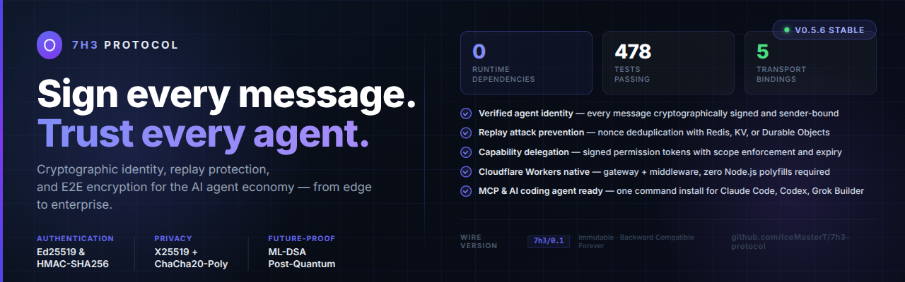
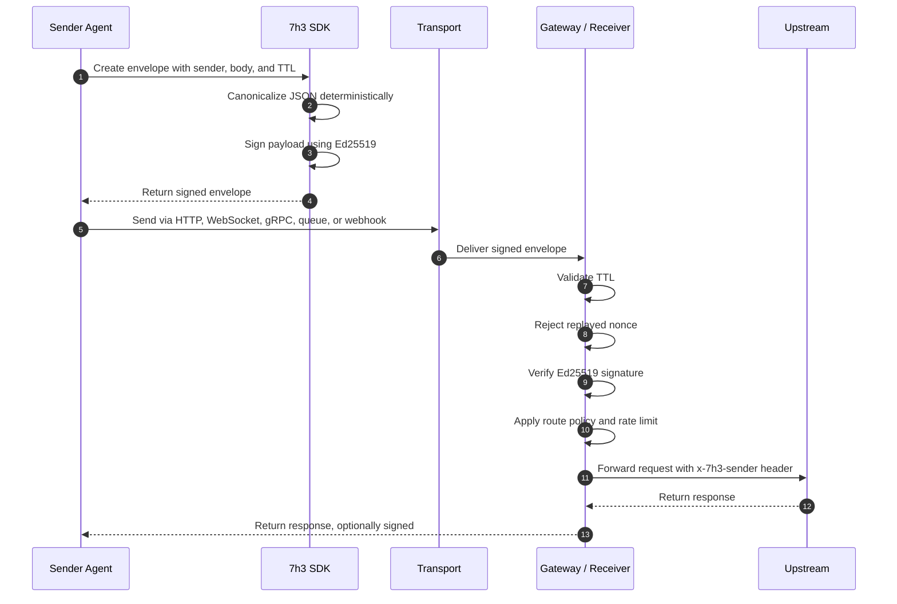
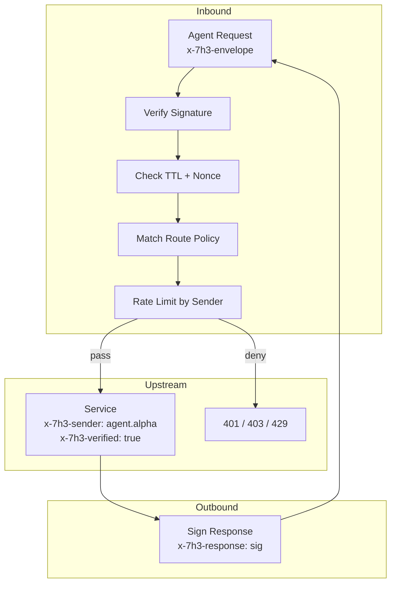
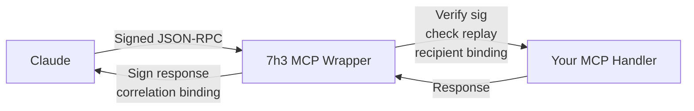
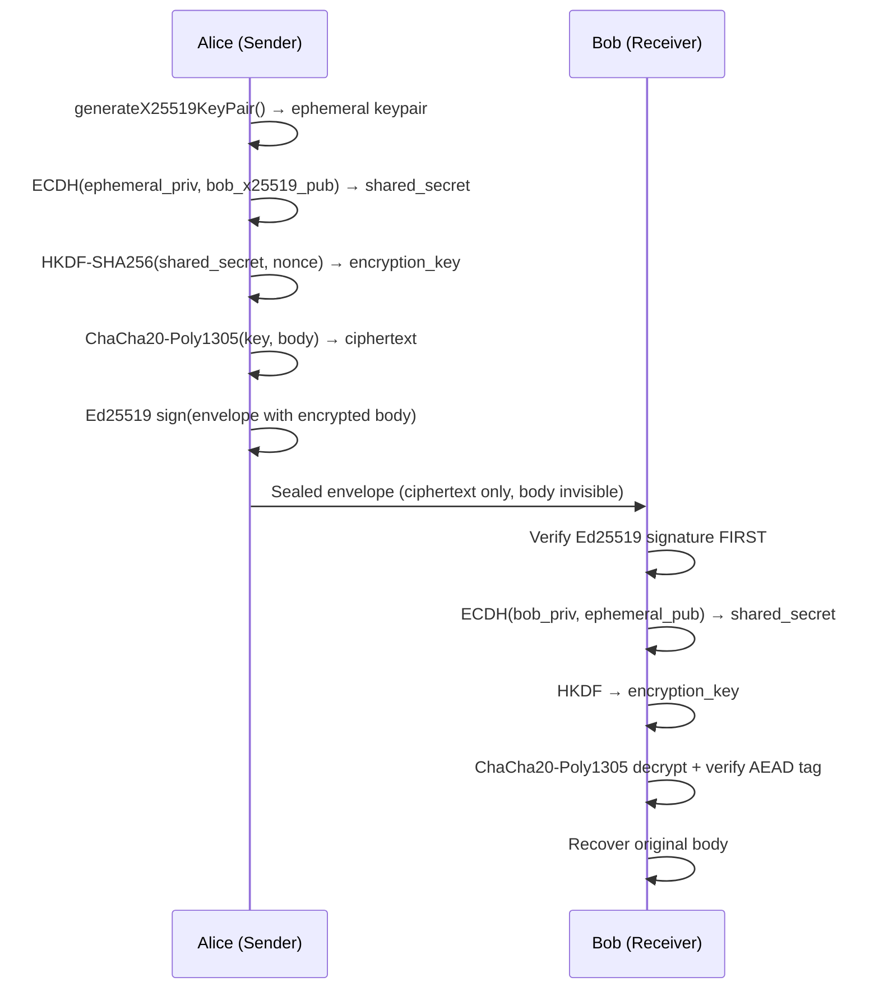
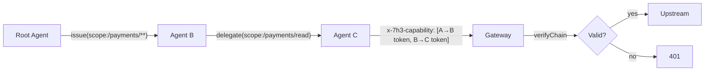
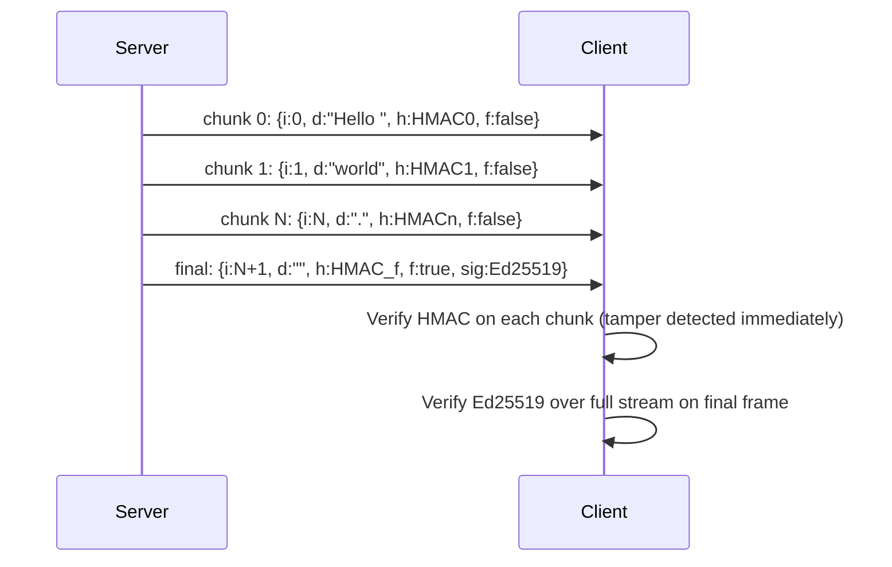
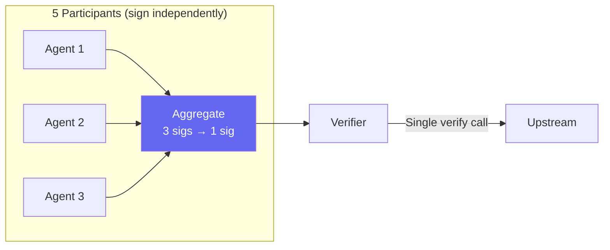

<div align="center">
  

  <br/><br/>

  [](https://www.npmjs.com/package/@7h3/protocol)
  [](https://www.npmjs.com/package/@7h3/protocol-pq)
  [](https://www.npmjs.com/package/@7h3/protocol-threshold)
  [](https://pypi.org/project/7h3-protocol/)
  [](https://crates.io/crates/protocol-7h3)
  [](https://github.com/IceMasterT/7h3-protocol/tree/main/src)
  [](./package.json)
  [](./docs/VERSIONING_POLICY.md)
  [](./LICENSE)

  <br/>

  **Cryptographic signing, replay protection, and E2E encryption for AI agent messages.**
  **One envelope. Every transport. Quantum-ready.**

  <br/>
</div>

---

## 🆕 WebMCP — signed tools for browser agents

**[`@7h3/protocol-webmcp`](./sdk/webmcp)** brings this protocol to
[WebMCP](https://webmachinelearning.github.io/webmcp/) (`document.modelContext`):
capability-scoped, replay-protected, cryptographically receipted tool calls.

> **Live demo → [7h3-webmcp-ledger.tech-b1a.workers.dev](https://7h3-webmcp-ledger.tech-b1a.workers.dev)**
> An agent-operable business console. Grant an agent `pay ≤ $50 for 10 minutes`,
> then watch it get refused — cryptographically — when it tries to exceed that.

Chrome's [agent security guidance](https://developer.chrome.com/docs/agents/security)
is entirely probabilistic (classifiers, spotlighting, critic LLMs) and silent on
authorization. OpenAI's site-tools docs state that *"a tool's name or claim that
it only reads data isn't proof of what it does"*, then tell sites to use their
**existing** authorization — which, for delegated agent action, no site has.

This is that missing layer, and it is deterministic. **A refusal is a failed
signature or an uncovered scope, not a judgement call.**

| | |
|---|---|
| **Signed tool manifests** | The origin signs its tool surface at deploy time and serves it at `/.well-known/7h3-webmcp-manifest.json`. Injected lookalike tools and silently reworded descriptions become detectable. |
| **Capability-scoped execution** | Scoped, expiring, revocable grants. Held page-side, so the token never passes through the agent. Spend ceilings are bound *inside* the signed token. |
| **Hash-chained receipts** | Every call recorded — allowed and refused. Deleting or reordering history breaks verification. |

Adoption is an import, a constructor, and one field per tool — see
[`sdk/webmcp/README.md`](./sdk/webmcp/README.md), which also documents the
threat model and what this explicitly does **not** protect against.

---

## Table of Contents

- [WebMCP — signed tools for browser agents](#-webmcp--signed-tools-for-browser-agents)
- [The Problem](#the-problem)
- [What 7h3 Protocol Does](#what-7h3-protocol-does)
- [How It Works](#how-it-works)
- [Security Guarantees](#security-guarantees)
- [Installation](#installation)
- [Quick Start](#quick-start)
- [Core API](#core-api)
- [Transports](#transports)
- [Gateway](#gateway)
- [Cloudflare Workers](#cloudflare-workers)
- [AI Coding Agents](#ai-coding-agents)
- [MCP (Claude Tool Calls)](#mcp-claude-tool-calls)
- [End-to-End Encryption](#end-to-end-encryption)
- [Capability Tokens and Delegation](#capability-tokens-and-delegation)
- [Streaming Message Signing](#streaming-message-signing)
- [Distributed Replay Cache (Redis)](#distributed-replay-cache-redis)
- [Binary Wire Format (CBOR)](#binary-wire-format-cbor)
- [Observability (Prometheus + OpenTelemetry)](#observability-prometheus--opentelemetry)
- [Post-Quantum Signatures (ML-DSA)](#post-quantum-signatures-ml-dsa)
- [Threshold Signatures (M-of-N BLS)](#threshold-signatures-m-of-n-bls)
- [Audit Log](#audit-log)
- [Rate Limiting](#rate-limiting)
- [Route Policies](#route-policies)
- [Key Infrastructure](#key-infrastructure)
- [Cross-SDK Conformance](#cross-sdk-conformance)
- [CLI Reference](#cli-reference)
- [Docker](#docker)
- [Uninstall](#uninstall)
- [Changelog](#changelog)
- [License](#license)

---

## The Problem

AI agent systems are moving fast, and the protocols underpinning them were not built with message-level security in mind.

**MCP (Model Context Protocol)** is plain JSON-RPC 2.0. A message in flight has no signature. Any intermediary — a rogue proxy, a compromised queue consumer, a misconfigured load balancer — can alter tool call parameters or replay a previously captured request. The MCP handler has no way to know.

**A2A (Agent-to-Agent)** signs Agent Cards — static configuration — not per-message traffic. Once an agent is "trusted," every message it sends is implicitly trusted regardless of whether that specific message was tampered with in transit or is a replay from ten minutes ago.

**HTTP APIs** default to IP-based rate limiting. IP addresses are trivially spoofed or shared. The same valid signed request can often be submitted multiple times, triggering duplicate writes, payments, or tool executions.

The gap these protocols share is identical: they authenticate *agents* at the connection or identity level, but they do not authenticate *individual messages* at the content level. 7h3 Protocol fills that gap without replacing anything.

---

## What 7h3 Protocol Does

7h3 Protocol wraps every message — regardless of transport — in a **signed envelope**. The envelope is compact, deterministic, and verifiable by any peer that holds the sender's public key.

**Feature set:**

| Feature | Mechanism |
|---|---|
| Message authentication | Ed25519 asymmetric signing or HMAC-SHA256 |
| Replay prevention | TTL + nonce deduplication (in-memory or Redis) |
| E2E encryption | X25519 key exchange + ChaCha20-Poly1305 AEAD |
| Capability delegation | Scoped, time-bounded, cryptographic credential chains |
| Streaming signing | Per-chunk HMAC + final Ed25519 over the full stream |
| Observability | Zero-dep Prometheus exposition + optional OpenTelemetry |
| Post-quantum | ML-DSA-65 / ML-DSA-87 (NIST FIPS 204) — `@7h3/protocol-pq` |
| Binary encoding | Deterministic CBOR (RFC 8949) — ~40% smaller than JSON |
| Threshold signing | M-of-N BLS12-381 aggregation — `@7h3/protocol-threshold` |
| Transport coverage | HTTP, WebSocket, gRPC, Queues, Webhooks |
| SDK coverage | TypeScript, Python, Rust, Go, Browser |

---

## How It Works

### Canonical Serialization

Signatures only mean something if everyone signs the same bytes. JSON object key order is unspecified by the spec, so 7h3 Protocol uses deterministic JSON canonicalization: keys are sorted alphabetically at every nesting level, optional absent fields are omitted entirely, and the result is UTF-8 encoded.

The canonical form is byte-identical across TypeScript, Python, Rust, and Go, proven by the shared conformance test vectors in `conformance/7h3_v0_1.json`.

### Envelope Structure

```json
{
  "body": {
    "capability":   "task.plan",
    "content":      "do something",
    "correlationId": "req-123",
    "intent":       "TASK"
  },
  "header": {
    "messageId":   "uuid-here",
    "nonce":       "random-bytes",
    "recipient":   "agent.beta",
    "sender":      "agent.alpha",
    "timestampMs": 1712500000000,
    "ttlMs":       60000,
    "version":     "7h3/0.1"
  },
  "signature": {
    "alg":   "ED25519",
    "keyId": "k1",
    "value": "base64url-sig-here"
  }
}
```

Optional fields (`capability`, `correlationId`, `recipient`) are omitted when absent — not `null`, not `""`. This is load-bearing for the canonical form.

### End-to-End Flow



### TTL and Nonce

Every envelope carries `timestampMs`, `ttlMs`, and a random `nonce`. A receiver rejects the envelope if `now > timestampMs + ttlMs`, then checks the nonce against a deduplication store. A replayed envelope fails even if the signature is valid.

---

## Security Guarantees

| Attack | Defense |
|---|---|
| Impersonation | Ed25519 — only the private key holder can produce a valid signature |
| Replay | Nonce deduplication + TTL expiry (in-memory or Redis) |
| Tampering | Signature covers the full canonical envelope; any modification breaks verification |
| Unauthorized access | Per-route `allowedSenders` policy — unlisted senders rejected before upstream |
| Response spoofing | Signed `x-7h3-response` header; `correlationId` binding |
| Rate abuse | `SlidingWindowRateLimiter` keyed by verified sender identity, not IP |
| Audit tampering | `InMemoryAuditLog` entries are Ed25519-signed and chained |
| Quantum computers | ML-DSA-65/87 via `@7h3/protocol-pq` (NIST FIPS 204) |
| Cross-instance replay | `RedisReplayStore` — atomic SET NX PX across all instances |
| Eavesdropping | X25519 + ChaCha20-Poly1305 E2E encryption |

---

## Installation

### TypeScript / Node.js

```bash
npm install @7h3/protocol
# or
pnpm add @7h3/protocol
# or
yarn add @7h3/protocol
```

Requires Node.js ≥ 20 (CI tests on Node 22). Zero runtime dependencies — uses Node.js built-in `crypto` throughout.

### Python

```bash
pip install 7h3-protocol
```

Requires Python ≥ 3.9. Optional extras for advanced features:

```bash
pip install 7h3-protocol[crypto]   # X25519 + ChaCha20 encryption (cryptography)
pip install 7h3-protocol[nacl]     # Alternative crypto backend (PyNaCl)
```

`RedisReplayStore` and ML-DSA post-quantum support have no dedicated extra — install their
backends directly (`pip install redis`, `pip install dilithium-py`); each module raises a clear
`ImportError` telling you which package it needs if it's missing.

### Rust

```toml
# Cargo.toml
[dependencies]
protocol-7h3 = "0.5"
```

### Go

```bash
go get github.com/IceMasterT/7h3-protocol/sdk/go
```

### Browser

```bash
npm install @7h3/protocol-browser
```

Pure Web Crypto API — no Node.js dependency. Works in Chrome 100+, Firefox 100+, Safari 16+, Edge 100+.

### Post-Quantum Extension

```bash
npm install @7h3/protocol-pq
```

Adds ML-DSA-65 and ML-DSA-87 (NIST FIPS 204 / Dilithium). Separate package to keep `@7h3/protocol` at zero runtime dependencies.

### Threshold Signatures Extension

```bash
npm install @7h3/protocol-threshold
```

Adds M-of-N BLS12-381 threshold signatures and Shamir Secret Sharing.

---

## Quick Start

```ts
import {
  generateEd25519KeypairBase64Url,
  createEnvelope,
  signEnvelopeEd25519,
  verifyEnvelopeEd25519,
} from '@7h3/protocol'

// 1. Generate keypairs
const sender   = await generateEd25519KeypairBase64Url()
const receiver = await generateEd25519KeypairBase64Url()

// 2. Create and sign a message
const envelope = createEnvelope({
  sender:  'agent.alpha',
  intent:  'TASK',
  content: 'summarize https://example.com',
  ttlMs:   60_000,
})

const signed = await signEnvelopeEd25519(envelope, sender.privateKey, 'key-1')

// 3. Transmit `signed` via any transport (HTTP header, WS frame, queue, etc.)

// 4. Verify on the receiving end
const ok = await verifyEnvelopeEd25519(signed, sender.publicKey)
if (!ok) throw new Error('signature verification failed')

console.log('Verified sender:', signed.header.sender)  // 'agent.alpha'
```

---

## Core API

### Key Generation

**TypeScript:**

```ts
import { generateEd25519KeypairBase64Url } from '@7h3/protocol'

const { publicKey, privateKey } = await generateEd25519KeypairBase64Url()
// publicKey:  SPKI format, base64url, ~44 chars
// privateKey: PKCS8 format, base64url, ~88 chars
```

**Python:**

The Python SDK has no built-in keygen helper — generate directly with `cryptography`
(PKCS8 private / SPKI public, base64url-encoded, matching every other SDK's key format):

```python
import base64
from cryptography.hazmat.primitives.asymmetric.ed25519 import Ed25519PrivateKey
from cryptography.hazmat.primitives import serialization

b64 = lambda b: base64.urlsafe_b64encode(b).decode('ascii').rstrip('=')

priv = Ed25519PrivateKey.generate()
private_key = b64(priv.private_bytes(
    encoding=serialization.Encoding.DER,
    format=serialization.PrivateFormat.PKCS8,
    encryption_algorithm=serialization.NoEncryption(),
))
public_key = b64(priv.public_key().public_bytes(
    encoding=serialization.Encoding.DER,
    format=serialization.PublicFormat.SubjectPublicKeyInfo,
))
```

**Rust:**

The Rust SDK only parses PKCS8/SPKI keys — it has no keygen helper either. Generate a
keypair with the CLI (`npx 7h3 keygen`) or another SDK, then pass the resulting
base64url strings into `sign_envelope_ed25519` / `verify_envelope_ed25519` (see below).

**Go:**

```go
import go7h3 "github.com/IceMasterT/7h3-protocol/sdk/go"

publicKey, privateKey, err := go7h3.GenerateKeypair()
```

**Browser:**

```ts
import { generateKeypair } from '@7h3/protocol-browser'

const { publicKey, privateKey } = await generateKeypair()
```

### Creating Envelopes

```ts
import { createEnvelope } from '@7h3/protocol'

const envelope = createEnvelope({
  sender:        'agent.alpha',
  intent:        'TASK',
  content:       'do something',
  capability:    'task.plan',     // optional
  correlationId: 'req-123',       // optional
  ttlMs:         60_000,          // default: 60000 (1 minute)
  recipient:     'agent.beta',    // optional
  messageId:     'custom-uuid',   // optional — auto-generated if omitted
})
```

### Signing

**Ed25519 (asymmetric — recommended):**

```ts
import { signEnvelopeEd25519 } from '@7h3/protocol'

const signed = await signEnvelopeEd25519(envelope, privateKey, 'key-id')
// signed.signature.alg === 'ED25519'
```

**HMAC-SHA256 (shared secret):**

```ts
import { signEnvelopeHmac } from '@7h3/protocol'

const signed = await signEnvelopeHmac(envelope, sharedSecret, 'key-id')
// signed.signature.alg === 'HS256'
```

**Python:**

```python
from protocol_7h3 import sign_envelope_ed25519, sign_envelope_hmac

signed = sign_envelope_ed25519(envelope, private_key, 'k1')
signed = sign_envelope_hmac(envelope, shared_secret, 'k1')
```

**Rust:**

```rust
use protocol_7h3::{sign_envelope_ed25519, sign_envelope_hmac};

let signed = sign_envelope_ed25519(&envelope, &private_key, "k1")?;   // Result<_, String>
let signed = sign_envelope_hmac(&envelope, &shared_secret, "k1");     // infallible, no `?`
```

**Go:**

```go
// Ed25519: keyId is derived internally from the public key, not passed in
signed, err := go7h3.SignEnvelopeEd25519(env, privateKey)
signed, err := go7h3.SignEnvelopeHmac(env, sharedSecret, "k1")
```

### Verifying

**TypeScript:**

```ts
import { verifyEnvelopeEd25519, verifyEnvelopeHmac } from '@7h3/protocol'

const ok = await verifyEnvelopeEd25519(signed, publicKey)  // Promise<boolean>
if (!ok) throw new Error('signature verification failed')

const ok2 = await verifyEnvelopeHmac(signed, sharedSecret)
```

Signature validity alone doesn't check TTL expiry or required fields — call
`validateEnvelope(signed)` (returns `ProtocolDiagnostic[]`) alongside verification for full checks.

**Python:**

```python
from protocol_7h3 import verify_envelope_ed25519

if not verify_envelope_ed25519(signed, public_key):  # returns bool
    raise ValueError('signature verification failed')
```

**Rust:**

```rust
use protocol_7h3::verify_envelope_ed25519;

let result = verify_envelope_ed25519(&signed, &public_key)?;
```

**Go:**

```go
ok, err := go7h3.VerifyEnvelopeEd25519(signed, publicKey)
```

---

## Transports

The same signed envelope is carried differently per transport. Verification logic is identical.

### HTTP / REST

The signed envelope travels as a JSON value in the `x-7h3-envelope` header.

**Signing outbound requests:**

```ts
import { createEnvelope, signHttpRequest } from '@7h3/protocol'

const envelope = createEnvelope({
  sender:  'agent.alpha',
  intent:  'TASK',
  content: JSON.stringify(payload),
})

const { headers } = await signHttpRequest(envelope, myPrivateKey)

await fetch('https://api.example.com/action', {
  method:  'POST',
  headers: { ...headers, 'Content-Type': 'application/json' },
  body:    JSON.stringify(payload),
})
```

**Verifying inbound requests (Express middleware):**

```ts
import { verifyHttpEnvelope, createStaticKeyRegistry } from '@7h3/protocol'

const keyRegistry = createStaticKeyRegistry(keyStore)   // { [senderId]: publicKey }

app.use(async (req, res, next) => {
  const result = await verifyHttpEnvelope(req.headers, { keyRegistry })
  if (!result.ok) return res.status(401).json({ error: result.reason })
  req.sender = result.envelope.header.sender
  next()
})
```

**Python:**

```python
from protocol_7h3 import build_signed_request_headers, verify_http_envelope, StaticKeyRegistry

# Signing — convenience wrapper builds the envelope and signs it in one call
headers = build_signed_request_headers(
    sender='agent.alpha', private_key=my_private_key,
    content=json.dumps(payload),
)

# Verifying (FastAPI/Flask middleware)
registry = StaticKeyRegistry(key_store)   # { sender_id: public_key }
ok, envelope, reason = verify_http_envelope(request.headers, registry)
if not ok:
    raise ValueError(reason)
```

**Go:**

```go
// go7h3.Middleware wraps an http.Handler directly — it verifies each
// request's envelope before calling next.
handler := go7h3.Middleware(keyRegistry, myHandler)
http.ListenAndServe(":8080", handler)
```

**CBOR encoding (smaller payloads):**

```ts
const { headers, body } = await signHttpRequest(envelope, myPrivateKey, { format: 'cbor' })
// headers['content-type'] === 'application/7h3-cbor'
// body: Uint8Array — send this as the request body instead of JSON
```

### WebSocket

Every frame is individually signed. Sequence numbers prevent reordering attacks.

```ts
import { wrapWebSocket, createStaticKeyRegistry } from '@7h3/protocol'

const ws = new WebSocket('wss://api.example.com')

// Sender
const binding = wrapWebSocket(ws, {
  sender:      'agent.alpha',
  privateKey:  myPrivateKey,
  keyRegistry: createStaticKeyRegistry(keyStore),   // to verify incoming frames too
})
await binding.send({ do: 'something' })   // payload is wrapped in a TASK envelope automatically

// Receiver
binding.onMessage((payload, envelope) => {
  console.log('Verified from:', envelope.header.sender)
})
binding.onVerifyFail((err, rawData) => {
  console.warn('Rejected frame:', err.message)
})
```

### gRPC

Envelope in `7h3-envelope-bin` gRPC metadata (JSON, `-bin` suffix per gRPC convention).

```ts
import { signGrpcCall, withGrpcVerification, createStaticKeyRegistry } from '@7h3/protocol'

// Client — build metadata to attach to the outbound call
const metadata = await signGrpcCall({ sender: 'agent.alpha', privateKey, ttlMs: 60_000 })
const call = client.myMethod(request, metadata)

// Server — wrap any async handler with verify logic
const verifiedHandler = withGrpcVerification(myHandler, {
  keyRegistry: createStaticKeyRegistry(keyStore),
})
// call.7h3Envelope holds the verified envelope inside myHandler; throws (with a gRPC
// status `code`) on missing/invalid/expired envelopes
```

### Message Queues

Envelope wraps payload as `{ envelope, payload }`. Works with SQS, RabbitMQ, Kafka, Pub/Sub.

```ts
import { signQueueMessage, verifyQueueMessage } from '@7h3/protocol'

// Producer — returns a ready-to-send JSON string: {"envelope": ..., "payload": ...}
const message = await signQueueMessage(
  { taskId: '123', action: 'process' },
  { sender: 'agent.alpha', privateKey, keyId: 'k1' }
)
await queue.send(message)

// Consumer — takes the raw JSON string directly; throws on invalid/expired/tampered
try {
  const { payload, envelope } = await verifyQueueMessage(rawMessage, { publicKey })
  processTask(payload)
} catch (err) {
  console.warn('Rejected queue message:', err)
}
```

Pass the same `replayCache` instance (e.g. `new InMemoryReplayCache()`) to every
`verifyQueueMessage`/`verifyQueueBatch` call in a consumer process to dedupe replayed messages.

### Webhooks

Compact `x-7h3-sig` header (HMAC or Ed25519) plus `x-7h3-ts` timestamp.

```ts
import { signWebhookHmac, verifyWebhookHmac, InMemoryWebhookReplayCache } from '@7h3/protocol'

// Sender (HMAC shared-secret — use signWebhook/verifyWebhook for Ed25519 instead)
const headers = await signWebhookHmac(body, { secret: sharedSecret, ttlMs: 300_000 })
// Sets: x-7h3-sig, x-7h3-ts

// Receiver — returns a plain boolean; pass a replayCache to reject re-delivery
const replayCache = new InMemoryWebhookReplayCache()
const ok = await verifyWebhookHmac(body, req.headers, {
  secret:    sharedSecret,
  maxAgeMs:  300_000,
  replayCache,
})
if (!ok) return res.status(401).end()
```

---

## Gateway

The `Protocol7h3Gateway` is a reverse proxy that verifies envelopes before forwarding to upstream. Drop it in front of any existing service.

`createGateway()` returns a `verify()`/`handle()` object — it doesn't bind a port itself,
so pair it with any HTTP server (Node's `http`, Express, a Workers `fetch` handler, etc.):

```ts
import { createServer } from 'node:http'
import { createGateway } from '@7h3/protocol/gateway'
import { createStaticKeyRegistry } from '@7h3/protocol/key-registry'

const gateway = createGateway({
  upstream:    'http://localhost:3001',
  keyRegistry: createStaticKeyRegistry({
    'agent.alpha': alphaPublicKey,
    'agent.beta':  betaPublicKey,
    'agent.admin': adminPublicKey,
  }),
  policies: [
    {
      path:           '/api/admin/**',
      require:        'ed25519',
      allowedSenders: ['agent.admin'],
      rateLimit:      { requests: 10, windowMs: 60_000 },
    },
    {
      path:           '/api/**',
      require:        'ed25519',
      allowedSenders: ['agent.alpha', 'agent.beta'],
      rateLimit:      { requests: 100, windowMs: 60_000 },
    },
  ],
  defaultPolicy: 'deny',   // reject anything that doesn't match a policy above
  signResponses: true,
  privateKey:    gatewayPrivateKey,
  sender:        'gateway',
})

createServer(async (req, res) => {
  const chunks: Buffer[] = []
  for await (const chunk of req) chunks.push(chunk)
  const result = await gateway.handle({
    method:  req.method ?? 'GET',
    path:    req.url ?? '/',
    headers: Object.fromEntries(
      Object.entries(req.headers).filter(([, v]) => v !== undefined),
    ) as Record<string, string>,
    body: chunks.length ? Buffer.concat(chunks).toString('utf8') : undefined,
  })
  res.writeHead(result.status, result.headers)
  res.end(result.body)
}).listen(3000)
```

Use `createProductionGateway()` instead of `createGateway()` to fail fast at startup if
`defaultPolicy` isn't `'deny'` or `replayStore` isn't configured — a misconfiguration you
want caught at deploy time, not discovered later in production.

**Gateway architecture:**



**CLI gateway** — a flag-based, single-policy gateway for quick use without writing code
(see [CLI Reference](#cli-reference) for the full flag list):

```bash
7h3 gateway --upstream http://localhost:3001 --port 3000 \
  --public-key <base64url-key> --sender agent.alpha --require ed25519
```

The CLI gateway supports one implicit sender/policy pair via flags — it does not read a
YAML/JSON config file. For multi-policy setups (per-route `allowedSenders`, rate limits,
mixed algorithms), use `createGateway()` directly as shown above.

---

## Cloudflare Workers

`cloudflare/` contains a complete Cloudflare Workers deployment — a cryptographic reverse proxy that enforces 7h3 signing on all inbound traffic, using KV for distributed key registry and nonce replay protection across all Cloudflare PoPs.

```
Caller ──[x-7h3-envelope]──▶ 7h3 Gateway Worker ──[clean + x-7h3-sender]──▶ Upstream
         Ed25519 signed         verify + strip                                 your Worker
```

### One-command setup

```bash
cd cloudflare
npm install
npm run setup     # generates keypair, creates KV namespaces, stores secret
```

Then set `UPSTREAM_URL` in `wrangler.toml` and deploy:

```bash
npm run deploy:staging
npm run deploy:production
```

### Middleware for existing Workers

Add 7h3 verification to any existing Worker without a full reverse-proxy setup:

```ts
import { create7h3Middleware } from './cloudflare/src/middleware'

export default {
  async fetch(request: Request, env: Env, ctx: ExecutionContext) {
    const mw = create7h3Middleware(env)
    const check = await mw.verify(request)
    if (!check.ok) return check.response   // 401 or 403

    // check.sender holds the verified agent identity
    return myHandler(request, env, ctx)
  },
}
```

### What's included

| File | Purpose |
|---|---|
| `cloudflare/src/worker.ts` | Standalone gateway entry point |
| `cloudflare/src/middleware.ts` | `create7h3Middleware()` for existing Workers |
| `cloudflare/src/kv-replay-store.ts` | KV-backed nonce dedup (cross-instance) |
| `cloudflare/src/kv-key-registry.ts` | KV-backed public key registry |
| `cloudflare/src/durable-replay.ts` | Durable Object for fully atomic replay |
| `cloudflare/wrangler.toml` | KV bindings, env vars, staging + production |
| `cloudflare/scripts/cf-setup.ts` | First-time setup automation |
| `cloudflare/DEPLOY.md` | Step-by-step deployment guide |

### Replay protection tiers

| Store | Consistency | Setup |
|---|---|---|
| `KvReplayStore` (default) | Strong within datacenter, ~60ms global lag | KV namespace (free plan) |
| `DurableReplayStore` | Fully atomic, zero race window | Durable Objects (paid plan) |

Register trusted agent public keys in KV:

```bash
wrangler kv:key put --namespace-id <ID> \
  "7h3:pk:agent@example.com" "<base64url-ed25519-spki-pubkey>"
```

Key discovery is served automatically at `GET /.well-known/7h3-keys`.

---

## AI Coding Agents

7h3 Protocol ships first-class support for AI coding environments. Each tool reads its config automatically — no plugin installation required.

| Tool | Config file | What it gets |
|---|---|---|
| Claude Code | `CLAUDE.md` + MCP server | Live keygen/sign/verify/scaffold tools + full repo context |
| GPT Codex | `AGENTS.md` | Full integration patterns, snippets, invariants |
| Opencode | `AGENTS.md` | Same |
| Grok Builder | `AGENTS.md` | Same |

### Claude Code — MCP server

Install the MCP server once to get live tools in every Claude Code session:

```bash
claude mcp add 7h3-protocol -- npx -y @7h3/protocol-mcp
```

Or copy `.claude/settings.example.json` → `.claude/settings.json` in your project.

Available MCP tools:

| Tool | Description |
|---|---|
| `7h3_generate_keypair` | Generate an Ed25519 keypair |
| `7h3_generate_secret` | Generate a 32-byte HMAC secret |
| `7h3_sign` | Sign a test envelope for debugging |
| `7h3_verify` | Verify an envelope's signature, TTL, and shape |
| `7h3_scaffold` | Generate integration code for a framework — `cloudflare-worker`, `nextjs`, `express`, `hono`, `fastify`, `claude-code`, or `raw` (narrower than `7h3 add`'s list below) |
| `7h3_mcp_config` | Get install config for Claude Code, Cursor, Opencode, Grok |
| `7h3_wrap_mcp_server` | Generate boilerplate to wrap an MCP handler with 7h3 |

### `7h3 add` — scaffold any project

Generate ready-to-paste integration code from the CLI:

```bash
# Framework integrations
npx 7h3 add --framework cloudflare-worker --sender agent@example.com
npx 7h3 add --framework nextjs            --sender agent@example.com
npx 7h3 add --framework express           --sender agent@example.com
npx 7h3 add --framework hono              --sender agent@example.com
npx 7h3 add --framework fastify           --sender agent@example.com

# AI tool setup instructions
npx 7h3 add --framework claude-code
npx 7h3 add --framework opencode
npx 7h3 add --framework codex
npx 7h3 add --framework grok

# Write to a file
npx 7h3 add --framework hono --output middleware/7h3-auth.ts
```

When called from the MCP server, `7h3_scaffold` does the same — Claude Code can call it directly and paste the result into your file.

---

## MCP (Claude Tool Calls)

Claude's tool-calling mechanism is MCP (Model Context Protocol) — plain JSON-RPC 2.0. 7h3 Protocol hardens MCP traffic without any changes to your handler.



**Server side:**

```ts
import { wrapMcpServer, signEnvelopeEd25519 } from '@7h3/protocol'

const secureServer = wrapMcpServer(myMcpHandler, {
  selfAgentId: 'my-mcp-server',
  sign: (e) => signEnvelopeEd25519(e, serverPrivateKey, 'k1'),
  receive: {
    signatureResolver: async (signature, senderId) =>
      ({ alg: 'ED25519', publicKey: clientPublicKeys[senderId] }),
  },
})
```

**Client side:**

```ts
import { wrapMcpClient, signEnvelopeEd25519 } from '@7h3/protocol'

const { send } = wrapMcpClient({
  selfAgentId: 'claude-agent',
  peerAgentId: 'my-mcp-server',
  sign: (e) => signEnvelopeEd25519(e, clientPrivateKey, 'k1'),
  receive: {
    signatureResolver: async () => ({ alg: 'ED25519', publicKey: serverPublicKey }),
  },
})

const result = await send({ jsonrpc: '2.0', id: 1, method: 'tools/list' }, fetch)
```

The MCP handler itself is unchanged — zero migration. The wrapper handles all envelope logic at the boundary.

---

## End-to-End Encryption

Signing proves authenticity. Encryption proves privacy. `sealEnvelope` combines both: the body is encrypted before signing so it's opaque to any intermediary, and signature is verified before decryption so tampering fails fast.

Forward secrecy is automatic — a fresh ephemeral X25519 keypair is generated per message.



Zero new dependencies — Node.js built-in `crypto.ecdh` + `crypto.createCipheriv('chacha20-poly1305')`.

**TypeScript:**

```ts
import {
  generateX25519KeyPair,
  sealEnvelope,
  openEnvelope,
} from '@7h3/protocol'

// Each agent needs an Ed25519 signing keypair + an X25519 encryption keypair
const aliceSign = await generateEd25519KeypairBase64Url()
const aliceEnc  = generateX25519KeyPair()   // synchronous

const bobSign = await generateEd25519KeypairBase64Url()
const bobEnc  = generateX25519KeyPair()

// Alice seals a message for Bob
const envelope = createEnvelope('alice', { intent: 'TASK', content: 'secret payload' })

const sealed = await sealEnvelope(envelope, {
  recipientX25519PublicKey: bobEnc.publicKey,
  senderEd25519PrivateKey:  aliceSign.privateKey,
})
// sealed.body.intent === 'ENCRYPTED'
// sealed.body.content is the encrypted blob — opaque to any eavesdropper

// Bob opens it
const { body } = await openEnvelope(sealed, {
  recipientX25519PrivateKey: bobEnc.privateKey,
  senderEd25519PublicKey:    aliceSign.publicKey,
})
// body.content === 'secret payload'
```

**Python:**

```python
from protocol_7h3.encryption import generate_x25519_keypair, seal_envelope, open_envelope

alice_enc_pub, alice_enc_priv = generate_x25519_keypair()
bob_enc_pub,   bob_enc_priv   = generate_x25519_keypair()

sealed = seal_envelope(envelope, bob_enc_pub, alice_sign_priv)
body   = open_envelope(sealed, bob_enc_priv, alice_sign_pub)
```

**Go:**

```go
bobPub, bobPriv, _ := go7h3.GenerateX25519KeyPair()

sealed, _       := go7h3.SealEnvelope(env, bobPub, alicePriv)
env, body, _    := go7h3.OpenEnvelope(sealed, bobPriv, alicePub)
```

---

## Capability Tokens and Delegation

Capability tokens let one agent grant another scoped, time-bounded, cryptographically verifiable authority — without sharing keys.

**Example:** service A grants service B permission to call `/api/payments/**` for 5 minutes. B can delegate a narrower scope to C. Any receiver can verify the full A → B → C chain.



**Issue a token:**

```ts
import { issueCapabilityToken } from '@7h3/protocol'

const token = await issueCapabilityToken({
  issuerPrivateKey: rootPrivateKey,
  issuerId:         'root-agent',
  subject:          'agent.worker',
  scopes: [
    { pathGlob: '/api/payments/**', methods: ['POST'], maxDelegations: 1 },
  ],
  ttlMs:          300_000,   // 5 minutes
  maxDelegations: 1,         // one more delegation hop allowed
})
```

**Delegate a narrower scope:**

```ts
import { delegateCapabilityToken } from '@7h3/protocol'

const delegation = await delegateCapabilityToken({
  parentToken:         token,
  delegatorPrivateKey: workerPrivateKey,
  delegatorId:         'agent.worker',
  newSubject:          'agent.subworker',
  scopes: [
    { pathGlob: '/api/payments/read', methods: ['GET'] },  // must be ⊆ parent
  ],
  ttlMs: 60_000,   // must not exceed parent's remaining TTL
})
```

**Attach to HTTP request:**

```ts
import { serializeCapabilityChain, CAP_HEADER } from '@7h3/protocol'

const headers = {
  [CAP_HEADER]: serializeCapabilityChain([token, delegation]),
  // x-7h3-capability: [base64-token-1, base64-token-2]
}
```

**Verify a chain:**

```ts
import { verifyCapabilityChain } from '@7h3/protocol'

const result = await verifyCapabilityChain(
  chain,
  { getPublicKey: async (id) => keyStore[id] },
  { requiredPathGlob: '/api/payments/read', requiredMethod: 'GET' }
)
// { ok: true, token, chain }  or  { ok: false, reason: '...' }
```

---

## Streaming Message Signing

LLM outputs are streams of tokens. 7h3 Streaming Signing gives each chunk a per-chunk HMAC and seals the entire stream with a final Ed25519 signature over the full content hash. Clients detect tampering mid-stream.



**Writing a signed stream:**

```ts
import { SignedStreamWriter } from '@7h3/protocol'

const writer = new SignedStreamWriter({
  privateKey: serverPrivateKey,
  sender:     'llm.server',
  keyId:      'k1',
})

for await (const token of llmTokenStream) {
  const chunk = await writer.writeChunk(token)
  ws.send(JSON.stringify(chunk))
}
ws.send(JSON.stringify(await writer.finalize()))
```

**Reading and verifying:**

```ts
import { SignedStreamReader } from '@7h3/protocol'

const reader = new SignedStreamReader({ publicKey: serverPublicKey })

ws.on('message', async (raw) => {
  const chunk = JSON.parse(raw)
  if (!chunk.f) {
    const r = await reader.receiveChunk(chunk)
    if (!r.ok) throw new Error(`Chunk ${chunk.i} tampered: ${r.reason}`)
    appendToUI(chunk.d)
  } else {
    const result = await reader.finalize(chunk)
    if (!result.ok) throw new Error(result.reason)
    console.log(`Stream verified — ${result.chunkCount} chunks, ${result.totalBytes} bytes`)
  }
})
```

**Convenience wrappers for complete arrays:**

```ts
import { signStream, verifyStream } from '@7h3/protocol'

const chunks = await signStream(
  ['Hello ', 'world', '.'],
  { privateKey, sender: 'llm', keyId: 'k1' }
)

const result = await verifyStream(chunks, { publicKey })
// { ok: true, totalBytes: 12, chunkCount: 3 }
```

**WebSocket integration:**

```ts
import { createSignedWebSocketStream, receiveSignedWebSocketStream } from '@7h3/protocol'

// Server side
const writer = createSignedWebSocketStream(ws, { privateKey, sender: 'llm', keyId: 'k1' })   // synchronous

// Client side
const result = await receiveSignedWebSocketStream(ws, { publicKey })
```

---

## Distributed Replay Cache (Redis)

The default in-memory replay cache breaks in multi-instance deployments. A replayed nonce can slip through between two gateway instances. Use `RedisReplayStore` in production.

```ts
import { createRedisReplayStore } from '@7h3/protocol'

const replayStore = createRedisReplayStore({ redisUrl: 'redis://localhost:6379' })

const gateway = createGateway({ ...opts, replayStore })
```

**Redis Cluster (queries all nodes — a nonce is seen if ANY node has it):**

```ts
import { createClusterReplayStore } from '@7h3/protocol'

const replayStore = createClusterReplayStore([
  'redis://node-1:6379',
  'redis://node-2:6379',
  'redis://node-3:6379',
])
```

**Inject your own Redis client:**

```ts
import { RedisReplayStore } from '@7h3/protocol'
import { createClient } from 'redis'

const client = createClient({ url: 'redis://localhost:6379' })
await client.connect()

const replayStore = new RedisReplayStore({ client })
// RedisClientLike: any client implementing set(k, v, opts) + get(k)
// Works with ioredis, redis, @upstash/redis
```

**Python:**

```python
from protocol_7h3.replay import create_redis_replay_store

store = create_redis_replay_store('redis://localhost:6379')
```

**Go:**

```go
store := go7h3.NewRedisReplayStore("7h3:nonce:", func(ctx context.Context, key string, ttl time.Duration) (bool, error) {
    return redisClient.SetNX(ctx, key, "1", ttl).Result()
})
```

---

## Binary Wire Format (CBOR)

CBOR (RFC 8949 deterministic mode) produces ~40% smaller payloads compared to JSON. Uses numeric field keys for maximum compactness.

```ts
import { encodeEnvelopeCbor, decodeEnvelopeCbor, CBOR_CONTENT_TYPE } from '@7h3/protocol'

// Encode
const bytes: Uint8Array = encodeEnvelopeCbor(signedEnvelope)
// bytes.length ≈ 60% of JSON.stringify(signedEnvelope).length

// Decode
const envelope = decodeEnvelopeCbor(bytes)

// HTTP
await fetch(url, {
  method:  'POST',
  headers: { 'Content-Type': CBOR_CONTENT_TYPE },  // 'application/7h3-cbor'
  body:    bytes,
})
```

**General-purpose CBOR (zero runtime deps):**

```ts
import { encodeCbor, decodeCbor } from '@7h3/protocol'

const bytes = encodeCbor({ any: 'value', nested: [1, 2, 3], ok: true })
const value = decodeCbor(bytes)
```

**Go:**

```go
bytes, err := go7h3.EncodeEnvelopeCBOR(env)
env, err   := go7h3.DecodeEnvelopeCBOR(bytes)
```

---

## Observability (Prometheus + OpenTelemetry)

### Prometheus Metrics

Zero new dependencies — implements the Prometheus exposition format from scratch.

```ts
import { metrics, renderPrometheusText, createMetricsMiddleware } from '@7h3/protocol'

// Serve /metrics on your existing Express app
app.use(createMetricsMiddleware('/metrics'))

// Or render manually
app.get('/metrics', (req, res) => {
  res.set('Content-Type', 'text/plain; version=0.0.4')
  res.send(renderPrometheusText(metrics))
})
```

**Available metrics:**

| Metric | Type | Labels |
|---|---|---|
| `7h3_verifications_total` | counter | `result` (ok\|fail), `alg`, `transport` |
| `7h3_verification_duration_ms` | histogram | — |
| `7h3_rate_limit_hits_total` | counter | `sender`, `path` |
| `7h3_sender_denials_total` | counter | `sender`, `path` |
| `7h3_replay_detections_total` | counter | `transport` |
| `7h3_audit_entries_total` | counter | `type` |
| `7h3_active_connections` | counter | `transport` |

**CLI gateway:**

```bash
7h3 gateway --upstream http://localhost:3001 --metrics-port 9090
# http://localhost:9090/metrics
```

### OpenTelemetry

No hard dependency — inject any OTel-compatible SDK:

```ts
import { setOtelProvider } from '@7h3/protocol'
import { trace } from '@opentelemetry/api'

setOtelProvider(trace.getTracerProvider())
// Spans emitted automatically for each verification:
// Span name: '7h3.verify', attributes: messageId, sender, alg, result
```

---

## Post-Quantum Signatures (ML-DSA)

Ed25519 is broken by a sufficiently large quantum computer. ML-DSA (Dilithium, NIST FIPS 204, 2024) is the standardized post-quantum signature algorithm. `@7h3/protocol-pq` is a drop-in replacement for the signing functions — same envelope format, different `alg` field.

```ts
import { generatePqKeyPair, signEnvelopePq, verifyEnvelopePq } from '@7h3/protocol-pq'
import { createEnvelope } from '@7h3/protocol'

// Generate a post-quantum keypair
const { publicKey, privateKey, algorithm } = generatePqKeyPair('ML-DSA-65')
// publicKey: 1,952 bytes, base64url

// Sign (same envelope format)
const envelope = createEnvelope('agent.alpha', { intent: 'TASK', content: 'hello' })
const signed   = await signEnvelopePq(envelope, privateKey, 'ML-DSA-65')
// signed.signature.alg === 'ML-DSA-65'

// Verify
const ok = await verifyEnvelopePq(signed, publicKey)
```

| Algorithm | NIST Level | Public key | Signature size | SDKs |
|---|---|---|---|---|
| `ML-DSA-44` | 2 (128-bit post-quantum) | 1,312 bytes | 2,420 bytes | Python only |
| `ML-DSA-65` | 3 (192-bit post-quantum) | 1,952 bytes | 3,293 bytes | TypeScript, Python |
| `ML-DSA-87` | 5 (256-bit post-quantum) | 2,592 bytes | 4,595 bytes | TypeScript, Python |

**Python:**

```python
from protocol_7h3.pq import generate_ml_dsa_keypair, sign_envelope_pq, verify_envelope_pq

pub, secret = generate_ml_dsa_keypair(level=65)
signed      = sign_envelope_pq(envelope, secret, level=65)
ok          = verify_envelope_pq(signed, pub, level=65)
```

---

## Threshold Signatures (M-of-N BLS)

High-stakes operations require M of N agents to co-sign before a message is valid. BLS12-381 aggregation: M agents sign independently, any party combines the M signatures into one, any verifier checks it with a single verify call identical to a regular verify.



```ts
import {
  generateBlsKeyPair,
  signEnvelopeBls,
  aggregateSignatures,
  verifyThresholdEnvelope,
} from '@7h3/protocol-threshold'

// Setup: 5 participants, require 3 to sign
const keys   = Array.from({ length: 5 }, () => generateBlsKeyPair())
const config = { m: 3, n: 5 }

// Create the envelope (unsigned)
const envelope = createEnvelope('council', { intent: 'TASK', content: 'deploy v2' })

// Any 3 participants sign independently — order doesn't matter
const partial1 = await signEnvelopeBls(envelope, keys[0].privateKey, 'agent-1')
const partial2 = await signEnvelopeBls(envelope, keys[1].privateKey, 'agent-2')
const partial3 = await signEnvelopeBls(envelope, keys[2].privateKey, 'agent-3')

// Any party aggregates the 3 partial signatures
const publicKeys = {
  'agent-1': keys[0].publicKey,
  'agent-2': keys[1].publicKey,
  'agent-3': keys[2].publicKey,
}
const thresholdEnvelope = await aggregateSignatures(
  [partial1, partial2, partial3],
  publicKeys,
  envelope,
  config,
)

// Verifier performs a single verify call
const allPublicKeys = Object.fromEntries(keys.map((k, i) => [`agent-${i+1}`, k.publicKey]))
const ok = await verifyThresholdEnvelope(thresholdEnvelope, allPublicKeys, config)
```

**Shamir Secret Sharing** — split one master BLS key into N shares; any M reconstruct it:

```ts
import { splitPrivateKey, reconstructPrivateKey } from '@7h3/protocol-threshold'

const masterKey = generateBlsKeyPair().privateKey
const shares    = splitPrivateKey(masterKey, 3, 5)   // split into 5 shares, need 3

// Distribute shares to 5 participants.
// Later, any 3 combine their shares to reconstruct the master key:
const recovered = reconstructPrivateKey([shares[0], shares[2], shares[4]], 3)
// recovered === masterKey
```

---

## Audit Log

Each event is logged as an independently Ed25519-signed entry — `log.verify()` proves a
given entry wasn't altered after being written. This is not a Cloudflare-Worker-native
gateway feature: the gateway does not write to it automatically, and entries aren't
chained to each other (there's no cross-entry tamper detection) — call `log.log(...)`
yourself wherever you want an entry recorded.

```ts
import { createAuditLog } from '@7h3/protocol'

const log = createAuditLog(auditPrivateKey, { maxEntries: 10_000 })

await log.log({
  type:   'verify-ok',   // 'verify-ok' | 'verify-fail' | 'rate-limited' | 'sender-denied' | 'response-signed'
  sender: 'agent.alpha',
  path:   '/api/action',
  envelopeId: 'msg-1',
})

// Read entries
const entries = await log.query({ sender: 'agent.alpha', limit: 100 })

// Verify a single entry's signature
const valid = await log.verify(entries[0], auditPublicKey)
// valid === true; false if that entry was tampered with
```

---

## Rate Limiting

`SlidingWindowRateLimiter` is keyed by verified sender identity, not IP. VPN and NAT do not grant extra quota.

```ts
import { SlidingWindowRateLimiter } from '@7h3/protocol'

// { maxKeys? } bounds total tracked senders (LRU-evicted); the rate-limit
// policy itself is passed per call, not at construction time.
const limiter = new SlidingWindowRateLimiter({ maxKeys: 50_000 })

const policy = { requests: 100, windowMs: 60_000 }

const result = limiter.consume('agent.alpha', policy)
// { allowed: true, remaining: 99, resetMs: 60000 }

const check = limiter.check('agent.alpha', policy)   // read-only, doesn't record a hit
```

---

## Route Policies

Glob-matched path policies enforce sender allowlists per route.

```ts
import { matchPolicy, isAllowedSender } from '@7h3/protocol'

const policies = [
  { path: '/api/admin/**', require: 'ed25519', allowedSenders: ['agent.admin'] },
  { path: '/api/**',       require: 'ed25519', allowedSenders: ['agent.alpha', 'agent.beta'] },
]

const matched = matchPolicy(policies, req.path)
if (matched && !isAllowedSender(matched, verifiedSender)) {
  return res.status(403).json({ error: 'sender not authorized' })
}
```

**Glob rules:**

| Pattern | Matches |
|---|---|
| `**` | Any number of path segments (including `/`) |
| `*` | Any characters within a single segment |
| `?` | Any single character |

---

## Key Infrastructure

### Static Registry

```ts
import { createStaticKeyRegistry } from '@7h3/protocol'

const registry = createStaticKeyRegistry({
  'agent.alpha': 'base64url-public-key',
  'agent.beta':  'base64url-public-key',
})
```

### Caching Registry (remote keys with TTL)

`createCachingKeyRegistry` wraps another `KeyRegistry` — it doesn't take a bare fetch
function directly:

```ts
import { createCachingKeyRegistry, type KeyRegistry } from '@7h3/protocol'

const remoteRegistry: KeyRegistry = {
  getPublicKey: async (senderId) => {
    const res = await fetch(`https://keys.example.com/${senderId}`)
    return (await res.json()).publicKey
  },
}

const registry = createCachingKeyRegistry(remoteRegistry, { ttlMs: 300_000 })
```

### Key Rotation

`KeyRotationManager` tracks a rolling set of keys with an overlap window, so a just-rotated
key keeps verifying for a grace period while peers catch up on the new one:

```ts
import { KeyRotationManager, generateEd25519KeypairBase64Url } from '@7h3/protocol'

const rotator = new KeyRotationManager({ maxAgeMs: 86_400_000, overlapMs: 3_600_000 })  // daily, 1h overlap

const { publicKey, privateKey } = await generateEd25519KeypairBase64Url()
rotator.addKey({ id: 'key-1', publicKey, privateKey, createdAt: Date.now() })

// Call periodically (e.g. on a cron); returns the new key only when rotation happened
const rotated = await rotator.rotateIfNeeded()
if (rotated) await publishPublicKey(rotated.id, rotated.publicKey)

// Serve /.well-known/7h3-keys directly from the manager
const doc = rotator.getWellKnownDocument()

// Or use it as a live KeyRegistry (falls back to null for unmanaged senders)
const registry = rotator.toKeyRegistry()
```

---

## Cross-SDK Conformance

All SDKs produce byte-identical canonical JSON. The shared conformance vector:

```json
{
  "body":   { "capability":"task.plan","content":"route:alpha->beta","correlationId":"corr-1","intent":"TASK" },
  "header": { "messageId":"vec-1","nonce":"nonce-vec-1","recipient":"agent.beta","sender":"agent.alpha","timestampMs":1712500000000,"ttlMs":60000,"version":"7h3/0.1" }
}
```

Each SDK verifies this exact byte sequence in its test suite. See `conformance/7h3_v0_1.json` for the complete vector set.

---

## CLI Reference

```bash
# Install globally
npm install -g @7h3/protocol

# Generate a keypair
7h3 keygen
# { "publicKey": "...", "privateKey": "...", ... }

# Sign a message — prefer --private-key-file <path> or $P7H3_PRIVATE_KEY over
# --private-key directly; a raw key on the command line lands in shell history
7h3 sign \
  --private-key-file ./my-key.txt \
  --sender agent.alpha \
  --payload "hello world"

# Verify an envelope
7h3 verify --public-key <base64url-key> --envelope "$(cat envelope.json)"

# Inspect an envelope without verifying
7h3 inspect --envelope "$(cat envelope.json)"

# Run the gateway (refuses to start unverified unless --allow-unverified is passed)
7h3 gateway --upstream http://localhost:3001 --public-key <base64url-key> --sender agent.alpha

# Run the gateway with metrics
7h3 gateway --upstream http://localhost:3001 --public-key <base64url-key> \
  --sender agent.alpha --metrics-port 9090

# Serve a key registry (one key/id pair)
7h3 keys serve --public-key <base64url-key> --key-id agent.alpha --port 3010
```

### `7h3 add` — scaffold integrations

Generate ready-to-paste code for any framework or AI coding tool:

```bash
# Framework integrations
npx 7h3 add --framework cloudflare-worker  --sender <sender-id>
npx 7h3 add --framework nextjs             --sender <sender-id>
npx 7h3 add --framework express            --sender <sender-id>
npx 7h3 add --framework hono               --sender <sender-id>
npx 7h3 add --framework fastify            --sender <sender-id>

# AI coding tool setup instructions
npx 7h3 add --framework claude-code   # prints MCP install + CLAUDE.md snippet
npx 7h3 add --framework opencode      # prints AGENTS.md snippet
npx 7h3 add --framework codex         # prints AGENTS.md snippet
npx 7h3 add --framework grok          # prints AGENTS.md snippet

# Write to a file instead of stdout
npx 7h3 add --framework hono --sender agent@example.com --output middleware/7h3.ts
```

Supported `--framework` values: `cloudflare-worker`, `nextjs`, `express`, `hono`, `fastify`, `claude-code`, `opencode`, `codex`, `grok`

---

## Docker

No image is published to a registry — build it locally from the included multi-stage `Dockerfile`.
Its `ENTRYPOINT` already runs `7h3 gateway`, so `docker run` arguments are gateway flags directly:

```bash
docker build -t 7h3-gateway .

docker run -p 8080:8080 \
  7h3-gateway --upstream http://host.docker.internal:3001 --public-key <base64url-key> --sender agent.alpha
```

**`docker-compose.yaml` (included in repo)** — brings up the gateway plus a minimal example
upstream on an internal network:

```yaml
services:
  gateway:
    build: .
    ports:
      - "8080:8080"
    command: ["--port", "8080", "--upstream", "http://api:3000", "--require", "ed25519"]
    depends_on:
      api:
        condition: service_started

  api:                    # minimal example upstream — replace with your real service
    image: node:22-alpine
    expose:
      - "3000"
```

```bash
docker compose up --build
```

---

## Uninstall

```bash
# npm
npm uninstall @7h3/protocol @7h3/protocol-pq @7h3/protocol-threshold

# Python
pip uninstall 7h3-protocol

# Rust — remove from Cargo.toml, then:
cargo update

# Go
go mod edit -droprequire github.com/IceMasterT/7h3-protocol/sdk/go
go mod tidy
```

---

## Changelog

### v0.5.6

- Fixed a CLI build regression from v0.5.5's release (`RedisReplayStore` was passed an
  incompatible client type in `bin/7h3.ts`'s default gateway replay store) with a small
  dedicated in-memory `ReplayStore` implementation

### v0.5.5

- **Gateway**: capability-token authentication now enforces `allowedSenders` and rate
  limits — previously it bypassed both on a valid capability chain
- **Path traversal fix**: gateway request paths are normalized once and reused for both
  policy matching and upstream forwarding, closing a bypass via encoded `..` segments
- Added optional replay-protection caches to `webhookBinding` and `wsBinding` (a captured
  valid webhook/WebSocket frame could otherwise be replayed within its TTL window)
- `SlidingWindowRateLimiter` now bounds tracked sender keys with LRU eviction
- CLI: `--private-key-file` and `P7H3_PRIVATE_KEY`/`GATEWAY_PRIVATE_KEY` env vars as
  alternatives to passing `--private-key` on the command line
- Non-finite `timestampMs`/`ttlMs` values can no longer defeat TTL, clock-skew, or replay
  checks; CBOR map decoding no longer allows `__proto__` prototype pollution
- Closed `cryptography` (Python, GHSA-g6cj-pr64-35w5) and `nanoid` (GHSA-2v37-7h3g-55p8)
  advisories across every workspace

### v0.5.4

- **Relicensed from MIT to Apache-2.0** (see [License](#license) for what this means for
  releases up to `v0.5.3`)
- **Critical**: gateway rate limiting now backed by persistent state (was resettable);
  queue bindings gained TTL/replay protection; HMAC shared-secret lookups are now bound to
  the claimed sender
- Rust: private keys are zeroized on drop and redacted from `Debug` output
- `/metrics` is gated by default; `ttlMs` is capped at 24h across all SDKs
- Repaired broken subpath exports and shipped the compiled CLI in the published package
- PyPI trusted publishing and crates.io publishing added to the release pipeline;
  `@7h3/protocol-pq` and `@7h3/protocol-threshold` wired into `publish.yml`

### v0.5.3

- Lint and typecheck gates turned fully green in CI
- Supply-chain hardening: SHA-pinned GitHub Actions, gitleaks scanning, CI gates, a
  documented nonce-entropy spec

### v0.5.2

- Constant-time HMAC verification in the Rust SDK; CSPRNG-sourced nonces
- LICENSE and post-rename branding fixes; CI corrections

### v0.5.1

- **Cloudflare Workers gateway** — `cloudflare/` directory: standalone reverse-proxy Worker (`worker.ts`), drop-in middleware (`create7h3Middleware`), KV-backed key registry (`KvKeyRegistry`), KV nonce replay store (`KvReplayStore`), Durable Object atomic replay store (`DurableReplayStore`); one-command setup script (`cf-setup.ts`) with `execFileSync` shell-injection protection; staging + production environments in `wrangler.toml`; key discovery at `GET /.well-known/7h3-keys`
- **AI coding agent integration** — `CLAUDE.md` (auto-loaded by Claude Code), `AGENTS.md` (auto-loaded by GPT Codex, Opencode, Grok Builder); MCP server v0.5.0 with 7 tools (`7h3_generate_keypair`, `7h3_generate_secret`, `7h3_sign`, `7h3_verify`, `7h3_scaffold`, `7h3_mcp_config`, `7h3_wrap_mcp_server`); one-line MCP install: `claude mcp add 7h3-protocol -- npx -y @7h3/protocol-mcp`
- **`7h3 add` CLI** — `npx 7h3 add --framework <name>` generates ready-to-paste integration code for 9 targets: `cloudflare-worker`, `nextjs`, `express`, `hono`, `fastify`, `claude-code`, `opencode`, `codex`, `grok`; optional `--output <file>` flag
- **MCP server renamed** — binary `aip-mcp` → `7h3-mcp`; env prefix `AIP_*` → `P7H3_*`; package `@7h3/protocol-mcp` v0.5.0

### v0.5.0

- **Redis replay cache** — `RedisReplayStore` / `ClusterRedisReplayStore` (atomic SET NX PX); injectable `RedisClientLike` interface; Go + Python SDKs
- **E2E encryption** — `sealEnvelope` / `openEnvelope` (X25519 + ChaCha20-Poly1305); ephemeral keypairs for forward secrecy; zero new deps; Python + Go SDKs
- **Capability tokens** — `issueCapabilityToken` / `delegateCapabilityToken` / `verifyCapabilityChain`; `x-7h3-capability` gateway header; glob-matched scope enforcement
- **Streaming signing** — `SignedStreamWriter` / `SignedStreamReader`; per-chunk HMAC + final Ed25519; WebSocket integration; `signStream` / `verifyStream` convenience API
- **Prometheus + OpenTelemetry** — zero-dep Prometheus text format; `createMetricsMiddleware`; CLI `--metrics-port`; optional OTel provider injection
- **Post-quantum** — `@7h3/protocol-pq`: ML-DSA-65 and ML-DSA-87 via `@noble/post-quantum`; Python via `dilithium-py`
- **CBOR** — zero-dep deterministic CBOR encoder/decoder (RFC 8949); `encodeEnvelopeCbor` / `decodeEnvelopeCbor`; HTTP CBOR binding; Go SDK
- **Threshold signatures** — `@7h3/protocol-threshold`: BLS12-381 M-of-N via `@noble/curves`; Shamir `splitPrivateKey` / `reconstructPrivateKey`

### v0.4.0

- API Gateway (`Protocol7h3Gateway`) with per-route policies, rate limiting, signed responses
- Go SDK (pure stdlib)
- Browser SDK (pure Web Crypto API)
- CLI (`7h3 keygen`, `sign`, `verify`, `inspect`, `gateway`, `keys serve`)
- Tamper-evident audit log (`InMemoryAuditLog`, Ed25519-signed chain)
- gRPC transport binding
- Dockerized gateway

### v0.3.0

- Python SDK — signing, verifying, conformance vectors
- Rust SDK — signing, verifying, canonical serialization
- Queue and Webhook transport bindings
- MCP wrapper (`wrapMcpServer`, `wrapMcpClient`)

### v0.2.0

- Renamed from `aip7h3` to `7h3-protocol` / `@7h3/protocol`
- WebSocket binding with sequence number protection
- Sliding window rate limiter keyed by verified sender
- Per-route policy engine with glob matching

### v0.1.0

- Core protocol: `createEnvelope`, `signEnvelopeEd25519`, `verifyEnvelopeEd25519`, `signEnvelopeHmac`, `verifyEnvelopeHmac`
- HTTP transport binding
- TypeScript SDK, zero runtime dependencies
- Canonical JSON serialization, cross-platform byte-identical

---

## License

Apache License 2.0 — see [`LICENSE`](./LICENSE) and [`NOTICE`](./NOTICE).

`SPDX-License-Identifier: Apache-2.0`

7h3 Protocol is a wire protocol meant to be implemented independently. Apache-2.0
§3 grants every user an express, irrevocable patent license from each contributor,
and terminates that grant for anyone who initiates patent litigation over the
work. MIT, which this project used through v0.5.3, is silent on patents.

Releases up to and including `v0.5.3` were published under the MIT license. That
grant is irrevocable and is not being withdrawn — anyone who obtained those
versions keeps their MIT rights to them permanently. Apache-2.0 applies from
`v0.5.4` onward.

Apache-2.0 is incompatible with GPLv2-only code (GPLv3 is unaffected). If you
vendor a 7h3 Protocol SDK into a GPLv2-only codebase, pin `v0.5.3`.

---

<div align="center">
  <sub>Wire version <code>7h3/0.1</code> is immutable — all v0.x releases are backwards-compatible at the wire level.</sub><br/>
  <sub>Apache License 2.0 © 2024–2026 IceMasterT</sub>
</div>
